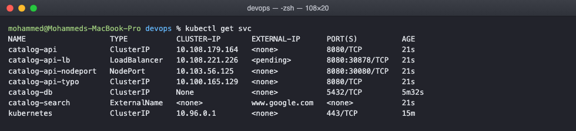
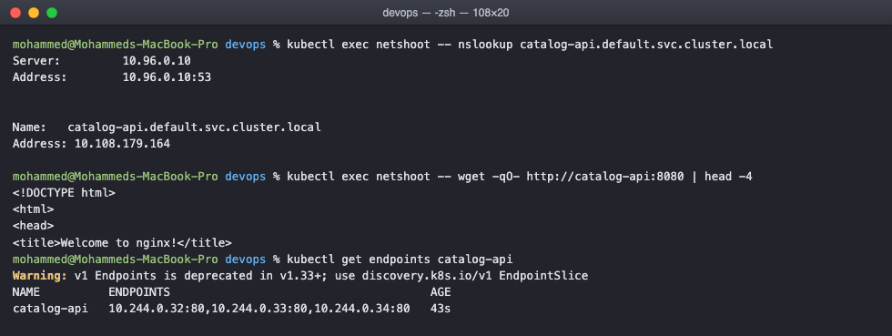
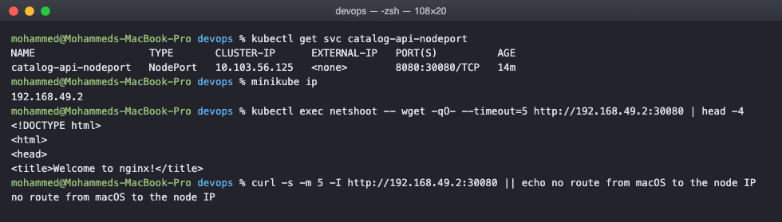
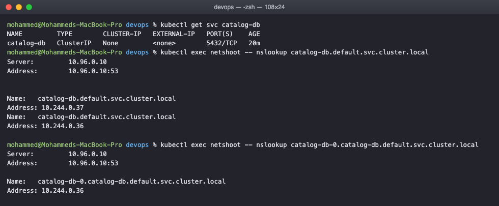
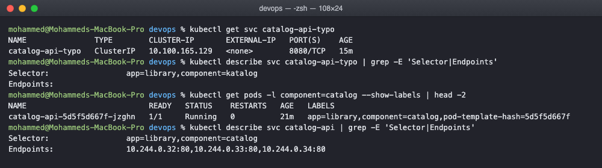

# Kubernetes Services Homework

Pods get a new IP every time they are recreated, so nothing can be addressed by pod IP.
A service is the stable thing in front of them. This task goes through the five service
types, the DNS names they create, and what an empty endpoints list means.

The pods behind all of these are the catalog-api deployment from the previous task.

## All five types side by side

    $ kubectl get svc
    NAME                   TYPE           CLUSTER-IP       EXTERNAL-IP      PORT(S)          AGE
    catalog-api            ClusterIP      10.108.179.164   <none>           8080/TCP         21s
    catalog-api-lb         LoadBalancer   10.108.221.226   <pending>        8080:30878/TCP   21s
    catalog-api-nodeport   NodePort       10.103.56.125    <none>           8080:30080/TCP   21s
    catalog-api-typo       ClusterIP      10.100.165.129   <none>           8080/TCP         21s
    catalog-db             ClusterIP      None             <none>           5432/TCP         5m32s
    catalog-search         ExternalName   <none>           www.google.com   <none>           21s
    kubernetes             ClusterIP      10.96.0.1        <none>           443/TCP          15m

Reading that table tells you most of the story. catalog-db has no cluster IP at all
because it is headless. catalog-search has no cluster IP and no ports because it is only
a DNS alias. The LoadBalancer is stuck on pending, which is covered further down.

## ClusterIP, the default

ClusterIP gives one virtual IP that only exists inside the cluster, and a DNS name to go
with it. The selector is the part that matters, not the name:

    spec:
      type: ClusterIP
      selector:
        app: library
        component: catalog
      ports:
        - port: 8080          # the port the service listens on
          targetPort: 80      # the port the container listens on

The two ports being different is on purpose, so it is obvious which is which. Callers use
8080 and the container still serves on 80.

    $ kubectl exec netshoot -- nslookup catalog-api.default.svc.cluster.local
    Server:    10.96.0.10
    Address:   10.96.0.10:53

    Name:   catalog-api.default.svc.cluster.local
    Address: 10.108.179.164

    $ kubectl exec netshoot -- wget -qO- http://catalog-api:8080 | head -4
    <!DOCTYPE html>
    <html>
    <head>
    <title>Welcome to nginx!</title>

    $ kubectl get endpoints catalog-api
    NAME          ENDPOINTS                                      AGE
    catalog-api   10.244.0.32:80,10.244.0.33:80,10.244.0.34:80   43s

Three things worth pulling out of that.

The DNS server is 10.96.0.10, which is the CoreDNS service from the first task. Every pod
is configured to use it.

The full name is service.namespace.svc.cluster.local. Inside the same namespace the short
name catalog-api is enough, which is why the wget worked with just the short name. From
another namespace you need at least catalog-api.default.

The endpoints object is the actual list of pod IPs behind the service, and it is what
kube-proxy programs into the node. The service is the stable front, endpoints are the
moving parts behind it.

## NodePort

NodePort opens the same port on every node so the app is reachable from outside the
cluster. The range is 30000 to 32767.

    $ kubectl get svc catalog-api-nodeport
    NAME                   TYPE       CLUSTER-IP      EXTERNAL-IP   PORT(S)          AGE
    catalog-api-nodeport   NodePort   10.103.56.125   <none>        8080:30080/TCP   14m

    $ minikube ip
    192.168.49.2

    $ kubectl exec netshoot -- wget -qO- --timeout=5 http://192.168.49.2:30080 | head -4
    <!DOCTYPE html>
    <html>
    <head>
    <title>Welcome to nginx!</title>

    $ curl -s -m 5 -I http://192.168.49.2:30080 || echo no route from macOS to the node IP
    no route from macOS to the node IP

This one caught me out, so it is worth writing down. The node port genuinely works, the
request from inside the cluster to the node's own IP on 30080 got the page. But the same
request from my Mac got nothing.

The reason is the minikube docker driver. The node is itself a container running inside
Docker Desktop's Linux VM, so 192.168.49.2 is an address inside that VM and my Mac has no
route to it. On a Linux machine, or on a real cluster, nodeIP:30080 would just work from
outside. The way around it on a Mac is minikube service catalog-api-nodeport --url, which
opens a tunnel and prints a localhost URL.

## LoadBalancer

    catalog-api-lb   LoadBalancer   10.108.221.226   <pending>   8080:30878/TCP

The external IP is pending and will stay that way. LoadBalancer is not something
Kubernetes implements itself, it is a request to the cloud provider to go and create a
real load balancer and report its address back. On EKS that gives an ELB, on GKE a Google
load balancer. On a laptop there is nobody listening to that request, so it sits pending
forever.

Note it still allocated a node port, 30878. A LoadBalancer service is a NodePort service
with a cloud load balancer pointed at it, which is why the types stack like that.

minikube tunnel will fake the cloud part and assign an address if you want to see it
complete.

## ExternalName

    spec:
      type: ExternalName
      externalName: www.google.com

No selector, no pods, no cluster IP. It is a CNAME record and nothing more. The point is
that code inside the cluster can always talk to catalog-search, and whether that resolves
to something inside or outside the cluster becomes a config decision rather than a code
change. The realistic use is a managed database that lives outside Kubernetes.

## Headless service

Setting clusterIP to None makes the service headless. Instead of one virtual IP that load
balances, DNS returns the pod IPs directly.

    $ kubectl get svc catalog-db
    NAME         TYPE        CLUSTER-IP   EXTERNAL-IP   PORT(S)    AGE
    catalog-db   ClusterIP   None         <none>        5432/TCP   20m

    $ kubectl exec netshoot -- nslookup catalog-db.default.svc.cluster.local
    Name:   catalog-db.default.svc.cluster.local
    Address: 10.244.0.37
    Name:   catalog-db.default.svc.cluster.local
    Address: 10.244.0.36

    $ kubectl exec netshoot -- nslookup catalog-db-0.catalog-db.default.svc.cluster.local
    Name:   catalog-db-0.catalog-db.default.svc.cluster.local
    Address: 10.244.0.36

The first lookup returned both pod IPs rather than one service IP. The second one is the
useful part: each statefulset pod gets its own DNS name of the form
podname.servicename.namespace.svc.cluster.local, and catalog-db-0 always resolves to pod
0 specifically.

That is exactly what a database cluster needs. A replica has to connect to the primary,
not to whichever pod a load balancer happens to pick, and this is how it finds it.

## When a service returns nothing

I created a service with a deliberate typo in the selector, component=katalog instead of
catalog. Kubernetes accepted it without complaint, because a selector that matches nothing
is not an error.

    $ kubectl describe svc catalog-api-typo | grep -E 'Selector|Endpoints'
    Selector:          app=library,component=katalog
    Endpoints:

    $ kubectl get pods -l component=catalog --show-labels | head -2
    NAME                           READY   STATUS    LABELS
    catalog-api-5d5f5d667f-jzghn   1/1     Running   app=library,component=catalog,pod-template-hash=5d5f5d667f

    $ kubectl describe svc catalog-api | grep -E 'Selector|Endpoints'
    Selector:          app=library,component=catalog
    Endpoints:         10.244.0.32:80,10.244.0.33:80,10.244.0.34:80

The broken service has an empty Endpoints line, the working one lists three pod IPs. From
the application side this looks like a hang or a connection refused, with nothing in any
pod's logs, because the request never reaches a pod at all.

So the first thing to check when a service does not work is kubectl get endpoints. If it
is empty, the problem is the selector and the pod labels not matching, not the network.

## Cleaning up

    kubectl delete -f manifests/ -f troubleshooting/

## What I understood

A service is two things at once, a stable name and a load balancer, and the endpoints
object in the middle is what connects it to real pods. Everything follows the labels, not
the names, which is why a one letter typo produces a service that looks perfectly healthy
and serves nothing.

The types are layered rather than alternatives. ClusterIP is internal only. NodePort is a
ClusterIP plus a port on every node. LoadBalancer is a NodePort plus a cloud load
balancer in front. Headless opts out of the whole load balancing idea and just publishes
pod addresses, and ExternalName is not really a service at all, it is a DNS alias.
