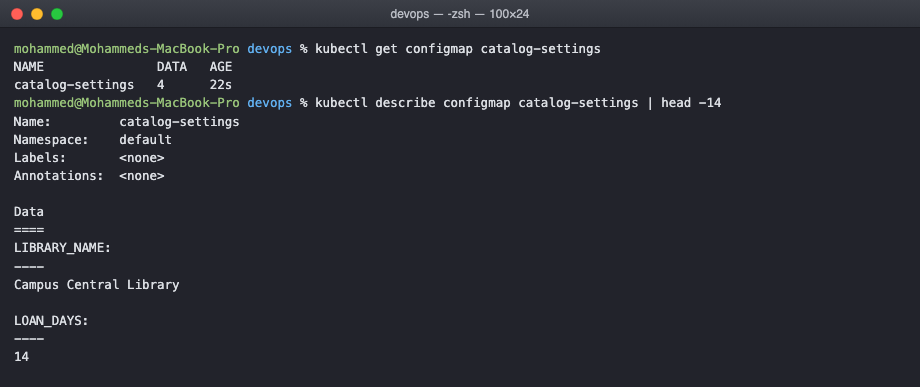
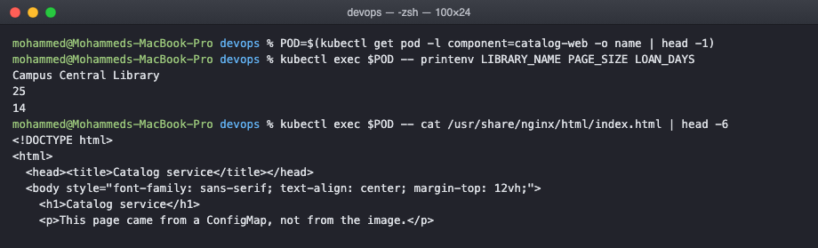
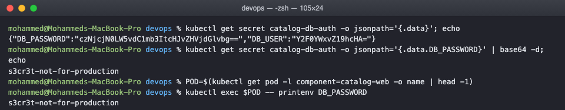
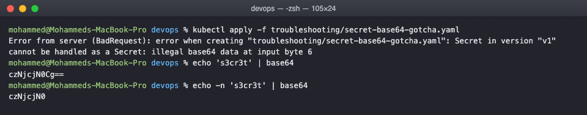
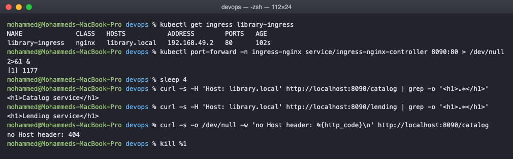
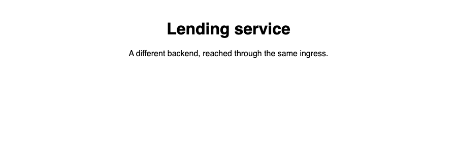

# Kubernetes Ingress, ConfigMaps and Secrets Homework

Taking configuration out of the image, keeping credentials out of the manifest, and
putting one entry point in front of two services.

The setup is two small services, catalog-web and lending-web, both plain nginx. What
makes them different is entirely configuration, which is the point of the first half of
this task.

## ConfigMap

A configmap holds configuration that is not secret. There are two useful shapes and I
used both in the same object:

    data:
      # plain values, used as environment variables
      LIBRARY_NAME: "Campus Central Library"
      PAGE_SIZE: "25"
      LOAN_DAYS: "14"

      # a whole file, mounted as /usr/share/nginx/html/index.html
      index.html: |
        <!DOCTYPE html>
        ...

    $ kubectl get configmap catalog-settings
    NAME               DATA   AGE
    catalog-settings   4      22s

DATA is 4 because there are four keys, three short values and one file.

### Getting it into a pod

Three ways, and the deployment uses all of them so I could see the difference.

One key at a time as an environment variable, which lets the variable be named something
different from the key:

    env:
      - name: LIBRARY_NAME
        valueFrom:
          configMapKeyRef:
            name: catalog-settings
            key: LIBRARY_NAME

Every key at once, keeping the same names:

    envFrom:
      - configMapRef:
          name: catalog-settings

Or as files, where each key becomes a file named after the key:

    volumes:
      - name: page
        configMap:
          name: catalog-settings
          items:
            - key: index.html        # only this key, not the whole configmap
              path: index.html

Checking all of it from inside a running pod:

    $ POD=$(kubectl get pod -l component=catalog-web -o name | head -1)
    $ kubectl exec $POD -- printenv LIBRARY_NAME PAGE_SIZE LOAN_DAYS
    Campus Central Library
    25
    14

    $ kubectl exec $POD -- cat /usr/share/nginx/html/index.html | head -6
    <!DOCTYPE html>
    <html>
      <head><title>Catalog service</title></head>
      <body style="font-family: sans-serif; text-align: center; margin-top: 12vh;">
        <h1>Catalog service</h1>
        
This page came from a ConfigMap, not from the image.

The image is stock nginx:1.27-alpine and the page it serves is mine. Nothing was built,
nothing was copied into an image. The items list matters, without it every key in the
configmap becomes a file in that directory, so LIBRARY_NAME and PAGE_SIZE would also end
up sitting in the web root.

One difference worth knowing: a mounted configmap updates in the pod when the configmap
changes, after a short delay. Environment variables do not, they are set once at start,
so changing a value there needs a rollout restart.

## Secret

A secret is shaped like a configmap but meant for credentials. Using stringData lets me
write the plain value and have Kubernetes do the encoding:

    stringData:
      DB_USER: catalog_app
      DB_PASSWORD: s3cr3t-not-for-production

    $ kubectl get secret catalog-db-auth -o jsonpath='{.data}'
    {"DB_PASSWORD":"czNjcjN0LW5vdC1mb3ItcHJvZHVjdGlvbg==","DB_USER":"Y2F0YWxvZ19hcHA="}

    $ kubectl get secret catalog-db-auth -o jsonpath='{.data.DB_PASSWORD}' | base64 -d
    s3cr3t-not-for-production

    $ kubectl exec $POD -- printenv DB_PASSWORD
    s3cr3t-not-for-production

Stored base64, delivered to the container in plain text. Which is the thing to be clear
about: base64 is not encryption, it is just encoding, and anyone who can read the secret
object can read the password. What actually protects a secret is RBAC on who may read it,
and encryption at rest configured on etcd. This password is a throwaway for the exercise,
a real one would come from a sealed secret or an external secrets manager, not from a
manifest in git.

### The base64 traps

Two mistakes that are easy to make. The first is writing a plain value under data:

    data:
      DB_PASSWORD: s3cr3t-not-for-production

    $ kubectl apply -f troubleshooting/secret-base64-gotcha.yaml
    Error from server (BadRequest): error when creating "troubleshooting/secret-base64-gotcha.yaml":
    Secret in version "v1" cannot be handled as a Secret: illegal base64 data at input byte 6

That one is caught, because the value is not valid base64. The dangerous version is when
the plain text happens to be valid base64, and then it is accepted and silently wrong.

The second trap is quieter and has no error at all:

    $ echo 's3cr3t' | base64
    czNjcjN0Cg==
    $ echo -n 's3cr3t' | base64
    czNjcjN0

The two are different. The first encoded a trailing newline along with the password, so
the application gets "s3cr3t\n" and authentication fails with a password that looks
completely correct when you print it. echo -n, or better stringData so the encoding never
happens by hand.

## Ingress

Without an ingress, exposing two services means two NodePorts or two cloud load
balancers. An ingress is one entry point that routes by host and path.

On minikube the controller has to be turned on first, since an ingress object does
nothing on its own:

    minikube addons enable ingress

The routing rules:

    spec:
      ingressClassName: nginx
      rules:
        - host: library.local
          http:
            paths:
              - path: /catalog(/|$)(.*)
                backend:
                  service:
                    name: catalog-web
              - path: /lending(/|$)(.*)
                backend:
                  service:
                    name: lending-web

    $ kubectl get ingress library-ingress
    NAME              CLASS   HOSTS           ADDRESS        PORTS   AGE
    library-ingress   nginx   library.local   192.168.49.2   80      102s

The ADDRESS column filling in is the sign the controller has picked the rule up. While it
is blank, nothing is serving the rule yet.

    $ curl -s -H 'Host: library.local' http://localhost:8090/catalog
    <h1>Catalog service</h1>

    $ curl -s -H 'Host: library.local' http://localhost:8090/lending
    <h1>Lending service</h1>

    $ curl -s -o /dev/null -w 'no Host header: %{http_code}\n' http://localhost:8090/catalog
    no Host header: 404

Two paths, two different backends, one port. The third request is the one that explains
how it works: the same URL without the Host header gets a 404. The ingress controller
routes on the Host header, so the hostname is part of the match, not decoration.

I reached it with kubectl port-forward to the ingress controller service because, as in
the previous task, the minikube node IP is not routable from macOS. On a normal setup you
would point DNS, or an /etc/hosts line, at the ingress address instead.

In a browser, with library.local mapped to that forwarded port:

Same host, same port, different path, different backend, and the page content itself came
from a configmap.

### About the rewrite

    annotations:
      nginx.ingress.kubernetes.io/rewrite-target: /$2

Without this the backend would receive /catalog as the path and nginx would look for a
/catalog file that does not exist, giving a 404 from the backend rather than from the
ingress. The capture groups in the path expression and the $2 here strip the prefix so
the backend sees /.

## Cleaning up

    kubectl delete -f manifests/
    minikube addons disable ingress

## What I understood

Configuration, credentials and routing are three things that should not be baked into an
image, and these three objects are how each one gets separated out. The same nginx image
became two different services purely through configmaps.

The mental split between configmap and secret is about intent rather than mechanism. They
work almost identically, and a secret is not encrypted by default, so treating base64 as
security is the mistake to avoid.

An ingress is a rule, not a program. Writing the object does nothing until a controller
exists to read it, which is why the addon had to be enabled first, and why ingressClassName
matters on a cluster that runs more than one controller.
