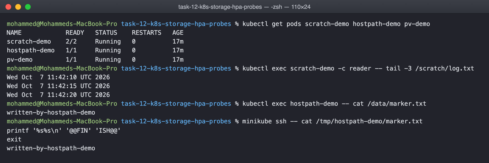
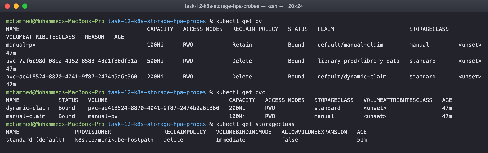

# Kubernetes volumes

A container's filesystem disappears when the container does. Volumes are how data
outlives that, and the types differ mainly in how long the data lives and who
provides the disk. The manifests next to this file were all applied on minikube.

## emptyDir

Scratch space created when the pod is scheduled and deleted when the pod is removed.
It survives a container restart inside the pod, which is the whole point: two
containers in one pod can share it.

    volumes:
      - name: scratch
        emptyDir: {}

In emptydir-pod.yaml a writer container appends the date to /scratch/log.txt every
five seconds and a reader container tails the same file:

    $ kubectl exec scratch-demo -c reader -- tail -3 /scratch/log.txt
    Wed Oct  7 11:47:25 UTC 2026
    Wed Oct  7 11:47:30 UTC 2026
    Wed Oct  7 11:47:35 UTC 2026

Delete the pod and the file is gone. Use it for caches, build scratch and sidecar
hand offs, never for anything that must survive.

## hostPath

A directory on the node mounted into the pod. The data outlives the pod, but only on
that node, and the pod can read whatever is in that host directory.

    volumes:
      - name: node-dir
        hostPath:
          path: /tmp/hostpath-demo
          type: DirectoryOrCreate

The pod wrote a marker and the same file is visible from the node itself:

    $ kubectl exec hostpath-demo -- cat /data/marker.txt
    written-by-hostpath-demo
    $ docker exec minikube cat /tmp/hostpath-demo/marker.txt
    written-by-hostpath-demo

If the pod lands on another node the data is not there, and giving a pod the host
filesystem is a security problem, so hostPath is for node agents such as log
shippers, and for single node experiments like this one.

## PersistentVolume and PersistentVolumeClaim

These split storage into two roles. A PersistentVolume is a piece of storage that
exists in the cluster, created by an admin or by a provisioner. A
PersistentVolumeClaim is a request from a user: I need 50Mi, read-write by one node.
Kubernetes binds the claim to a volume that satisfies it, and the pod only refers to
the claim. The application never knows what the disk actually is.

pv-pvc-pod.yaml does this the manual way. The PV is 100Mi of hostPath with
storageClassName manual, the PVC asks for 50Mi from class manual, and they bind:

    $ kubectl get pv
    NAME        CAPACITY   ACCESS MODES   RECLAIM POLICY   STATUS   CLAIM                  STORAGECLASS
    manual-pv   100Mi      RWO            Retain           Bound    default/manual-claim   manual

The reclaim policy matters. Retain keeps the data when the claim is deleted, so an
admin has to clean up by hand. Delete removes the volume with the claim, which is the
default for dynamically provisioned storage.

## StorageClass and dynamic provisioning

Writing a PersistentVolume for every claim does not scale. A StorageClass names a
provisioner that creates volumes on demand. dynamic-pvc.yaml only contains a claim,
no PV anywhere:

    $ kubectl get storageclass
    NAME                 PROVISIONER                RECLAIMPOLICY   VOLUMEBINDINGMODE
    standard (default)   k8s.io/minikube-hostpath   Delete          Immediate

    $ kubectl get pvc
    NAME            STATUS   VOLUME                                     CAPACITY   STORAGECLASS
    dynamic-claim   Bound    pvc-ae418524-...                           200Mi      standard
    manual-claim    Bound    manual-pv                                  100Mi      manual

The dynamic claim is bound to a volume named pvc-ae41..., which the minikube hostpath
provisioner created the moment the claim appeared. On a cloud cluster the provisioner
would be EBS, Persistent Disk or Azure Disk and the class would say gp3 or similar.
The claim in the manifest would be identical, which is the point.

The manual claim got a 100Mi volume for a 50Mi request because binding picks the
smallest existing volume that fits, it does not resize.

## What I understood

Pick by lifetime. emptyDir lives with the pod, hostPath lives with the node, a
PersistentVolume lives with the cluster. For anything real use a claim against a
StorageClass and let the cluster provision, because that is the only option that
works the same way on a laptop and in the cloud.
