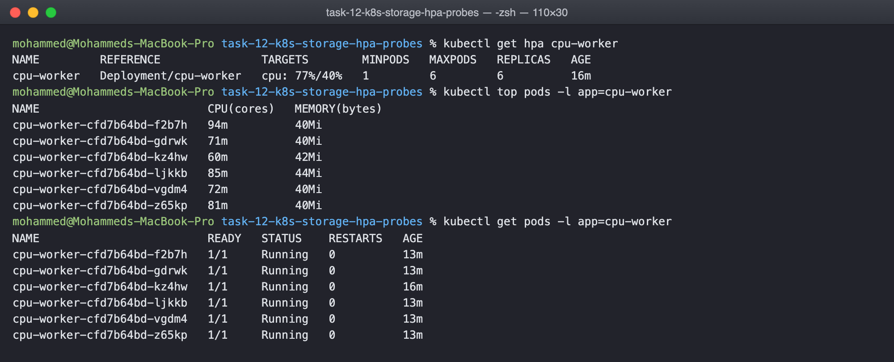
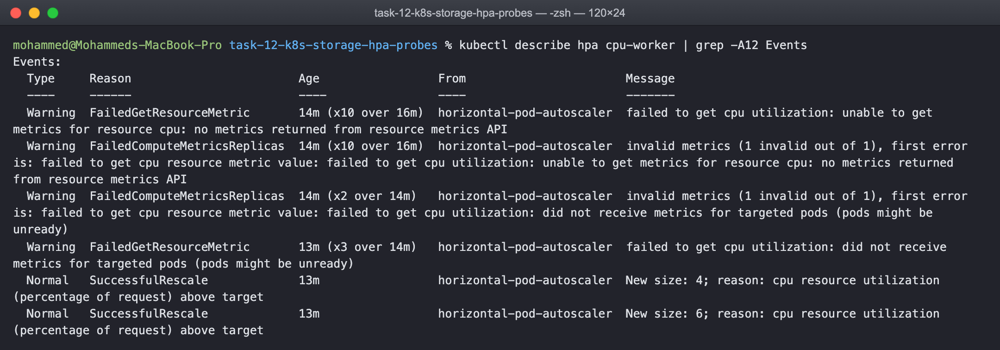
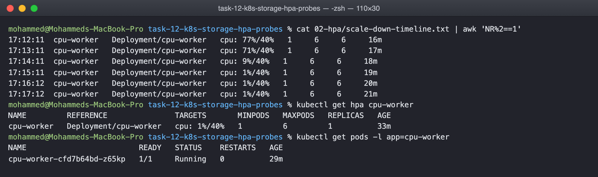
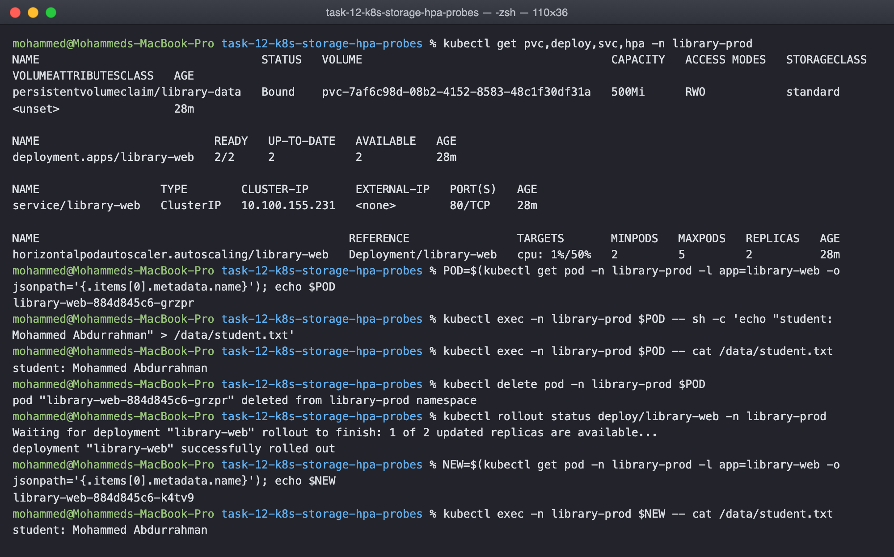
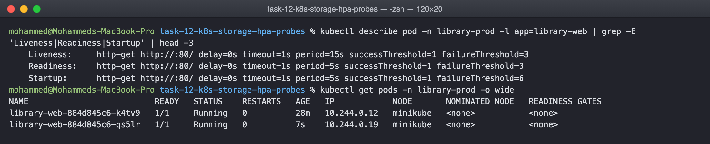

# Kubernetes Storage, HPA and Probes Homework

Three parts. The volume write up with worked examples is in
01-kubernetes-volumes/README.md. The HPA hands on is in 02-hpa and the mini project,
which combines a PersistentVolumeClaim, an autoscaler and all three probes, is in
03-mini-project.

## Task 1: volumes

See 01-kubernetes-volumes/README.md. It covers emptyDir, hostPath,
PersistentVolume, PersistentVolumeClaim, StorageClass and dynamic provisioning, each
with a manifest that was applied and its output.

## Task 2: HPA hands on

The deployment in 02-hpa/deployment.yaml runs a php page that burns CPU on every
request, with a request of 100m CPU so the autoscaler has something to measure
against. The HPA targets 40 percent of that request, between 1 and 6 replicas.

    minikube addons enable metrics-server
    kubectl apply -f 02-hpa/deployment.yaml -f 02-hpa/hpa.yaml

Before load, one pod and the target reads unknown until the first metrics arrive:

    16:57:45  cpu-worker   Deployment/cpu-worker   cpu: <unknown>/40%   1   6   1

Then the load generator, a busybox pod calling the service in a tight loop:

    kubectl apply -f 02-hpa/load-generator.yaml

I logged kubectl get hpa every 30 seconds. This is the real timeline:

    16:58:45  cpu-worker   Deployment/cpu-worker   cpu: <unknown>/40%   1   6   1
    16:59:16  cpu-worker   Deployment/cpu-worker   cpu: 276%/40%        1   6   4
    16:59:46  cpu-worker   Deployment/cpu-worker   cpu: 276%/40%        1   6   6
    17:00:16  cpu-worker   Deployment/cpu-worker   cpu: 102%/40%        1   6   6
    17:01:16  cpu-worker   Deployment/cpu-worker   cpu: 71%/40%         1   6   6
    17:05:18  cpu-worker   Deployment/cpu-worker   cpu: 74%/40%         1   6   6

One pod hit 276 percent of its request. The HPA went to 4 replicas in one step, then
to the maximum of 6 thirty seconds later. Utilisation came down as the load spread
but stayed above 40 percent, so it would have kept scaling if the maximum allowed.

    $ kubectl get hpa cpu-worker
    NAME         REFERENCE               TARGETS        MINPODS   MAXPODS   REPLICAS   AGE
    cpu-worker   Deployment/cpu-worker   cpu: 77%/40%   1         6         6          16m

    $ kubectl top pods -l app=cpu-worker
    NAME                         CPU(cores)   MEMORY(bytes)
    cpu-worker-cfd7b64bd-f2b7h   94m          40Mi
    cpu-worker-cfd7b64bd-gdrwk   71m          40Mi
    cpu-worker-cfd7b64bd-kz4hw   60m          42Mi
    cpu-worker-cfd7b64bd-ljkkb   85m          44Mi
    cpu-worker-cfd7b64bd-vgdm4   72m          40Mi
    cpu-worker-cfd7b64bd-z65kp   81m          40Mi

kubectl describe hpa shows the decisions as events, including the arithmetic the
controller used, which is the fastest way to understand why it did what it did:

After deleting the load generator the utilisation dropped to a few percent within a
minute, but the replica count stayed at 6 for five minutes. That is the scale down
stabilisation window, which stops the autoscaler from flapping when traffic dips
briefly:

Two things that bit me. The HPA shows unknown and does nothing at all unless
metrics-server is running and the container has a CPU request, because percent of
nothing is undefined. And the numbers lag by about a minute, which is the metrics
scrape interval plus the HPA sync period, so the timeline above is always a little
behind what the pods were actually doing.

## Task 3: mini project

03-mini-project deploys a two replica nginx in its own namespace with a 500Mi claim
mounted at /data, startup, readiness and liveness probes, CPU requests, and an HPA
from 2 to 5 replicas at 50 percent.

    kubectl apply -f 03-mini-project/namespace.yaml
    kubectl apply -f 03-mini-project/

    $ kubectl get pvc,deploy,svc,hpa -n library-prod
    persistentvolumeclaim/library-data   Bound    pvc-7af6c98d-...   500Mi   RWO   standard
    deployment.apps/library-web          2/2     2            2
    service/library-web                  ClusterIP   10.100.155.231   80/TCP
    horizontalpodautoscaler/library-web  Deployment/library-web   cpu: 1%/50%   2   5   2

The persistence test: write a file through one pod, delete that pod, read the file
through whichever pod is left:

    $ kubectl exec -n library-prod $POD -- sh -c 'echo "student: Mohammed Abdurrahman" > /data/student.txt'
    $ kubectl delete pod -n library-prod $POD
    pod "library-web-884d845c6-grzpr" deleted from library-prod namespace
    $ kubectl rollout status deploy/library-web -n library-prod
    deployment "library-web" successfully rolled out
    $ kubectl exec -n library-prod $NEW -- cat /data/student.txt
    student: Mohammed Abdurrahman

The file was there after the pod that wrote it was gone, because it lives on the
claim, not in the container. Both replicas mount the same claim here, which works on
a single node with ReadWriteOnce; on a multi node cluster that would need
ReadWriteMany or one claim per pod through a StatefulSet.

The three probes on each container:

    Liveness:   http-get http://:80/ delay=0s timeout=1s period=15s #success=1 #failure=3
    Readiness:  http-get http://:80/ delay=0s timeout=1s period=5s  #success=1 #failure=3
    Startup:    http-get http://:80/ delay=0s timeout=1s period=5s  #success=1 #failure=6

Startup gives the container up to 30 seconds before the others begin. Readiness
decides whether the pod is in the service's endpoints and never restarts anything.
Liveness restarts the container after three failures 45 seconds apart. Getting the
liveness probe too aggressive is the classic way to put a healthy but slow
application into a restart loop.

## Cleaning up

    kubectl delete -f 03-mini-project/ -f 02-hpa/ -f 01-kubernetes-volumes/
    kubectl delete pvc --all
