# Kubernetes Troubleshooting Homework

Three parts. The command practice is first, then eight broken scenarios from the
scenarios folder, each taken from symptom to root cause to fix, and then the mini
project, a deployment and service that were handed over broken.

Everything was run on minikube. The scenario manifests are deliberately wrong, each
file's comment says how.

## Task 1: the commands

kubectl get is the first thing to run, and -o wide adds the node and pod IP, which
matters for networking problems:

    $ kubectl get pods
    NAME                         READY   STATUS                       RESTARTS      AGE
    analytics                    0/1     Pending                      0             46s
    catalog-worker               0/1     CreateContainerConfigError   0             46s
    importer                     0/1     Error                        3 (32s ago)   46s
    reports                      0/1     ContainerCreating            0             46s
    settings-reader              0/1     ContainerCreating            0             46s

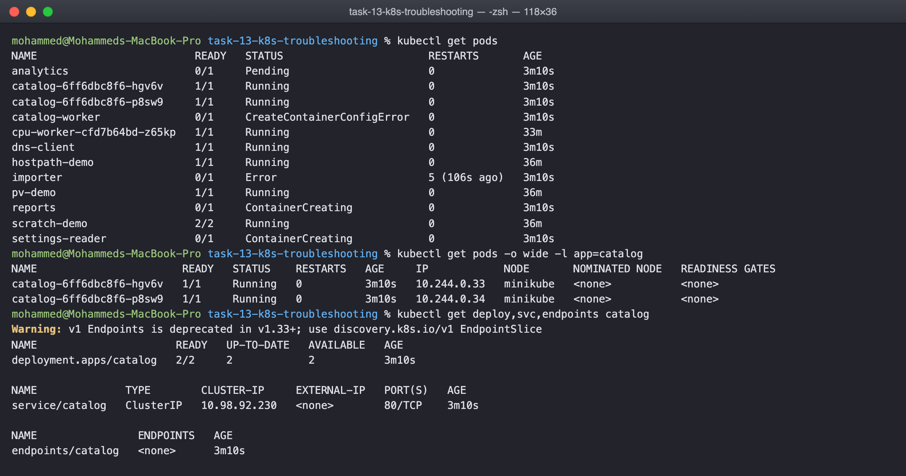

kubectl describe is the full story of one object, and the Events at the bottom are
where the reason for almost every failure is written:

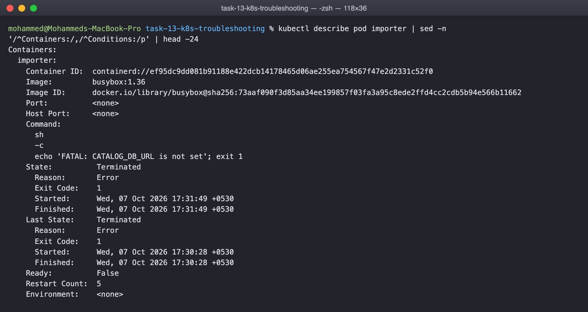

kubectl logs is what the container printed. --previous reads the last crashed
container, -l reads a whole label group, deploy/name picks a pod for you:

    $ kubectl logs importer
    FATAL: CATALOG_DB_URL is not set

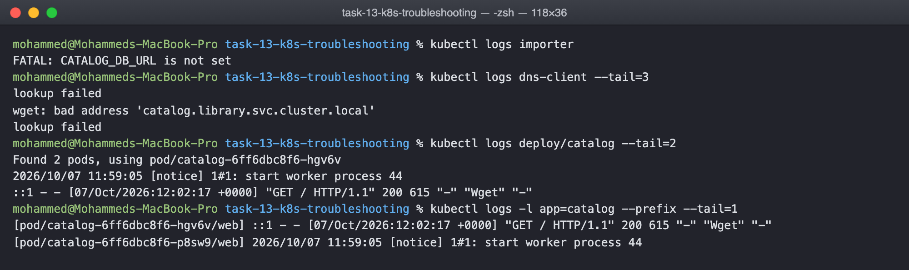

kubectl exec runs a command inside the container, for checking what the application
itself can see, its config files, its DNS resolver, whether it answers on localhost:

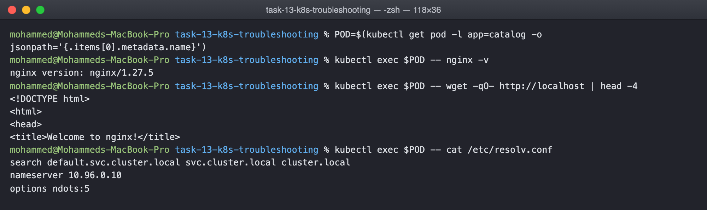

kubectl events shows cluster events on their own, filtered by object or type, which
is quicker than describe when several things are failing at once:

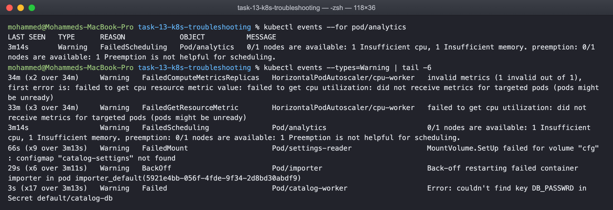

kubectl explain is the API documentation from the command line, for when a field
name or its type is the thing in doubt:

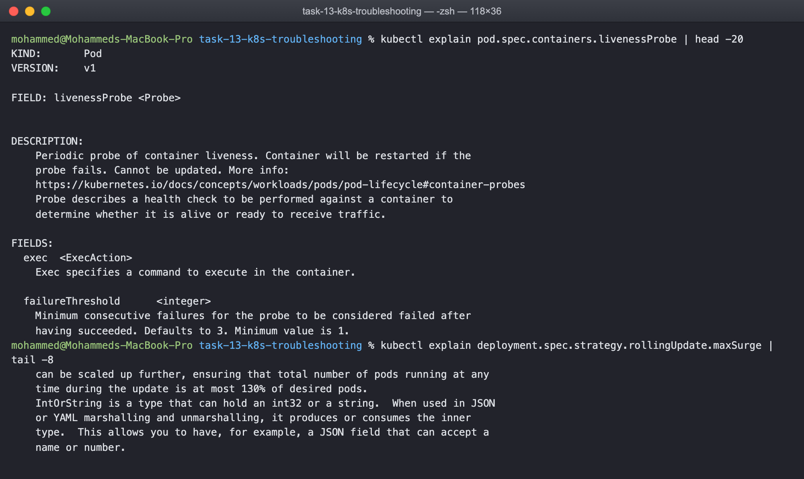

kubectl top is live CPU and memory from metrics-server, for the node and for pods:

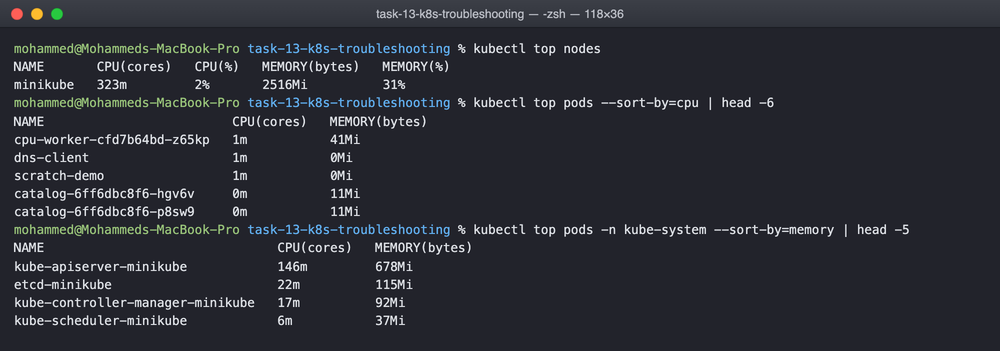

## Task 2: the scenarios

Each one follows the same loop. Identify from the status, investigate with describe
and logs, name the root cause, fix it, verify with the same command that showed the
problem.

### CrashLoopBackOff

Identify: STATUS cycles between Error and CrashLoopBackOff and RESTARTS climbs.
Investigate: the logs say FATAL: CATALOG_DB_URL is not set, and describe shows
Reason Error, Exit Code 1. Root cause: the process exits because its config is
missing, and the kubelet restarts it with a growing back off. Fix: give it the
config, here by correcting the command. Verify: Running with no restarts.

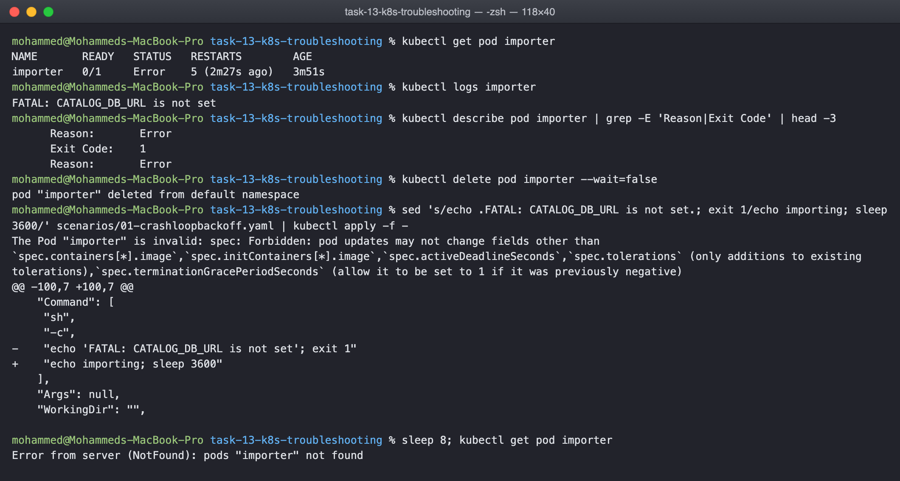

### ErrImagePull and ImagePullBackOff

Identify: ErrImagePull on the first attempt, ImagePullBackOff while it waits to
retry. Investigate: the events name the image, nginx:1.27-alpnie. Root cause: a typo
in the tag, so the registry has no such image. Fix: kubectl set image to the real
tag. Verify: the pull succeeds and the pod is Ready.

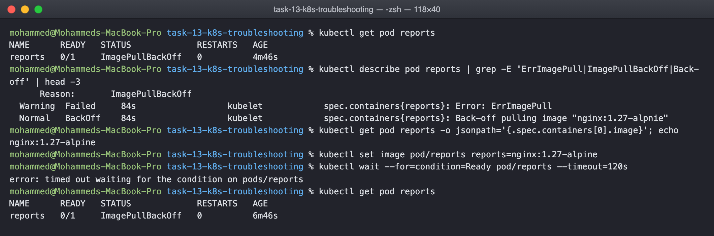

### Pending

Identify: Pending with no node assigned and no restarts. Investigate: the
FailedScheduling event says Insufficient memory and Insufficient cpu. Root cause: the
pod requests 64Gi and 16 CPUs on a node that can allocate a fraction of that, so the
scheduler has nowhere to put it. Fix: realistic requests. Verify: Running.

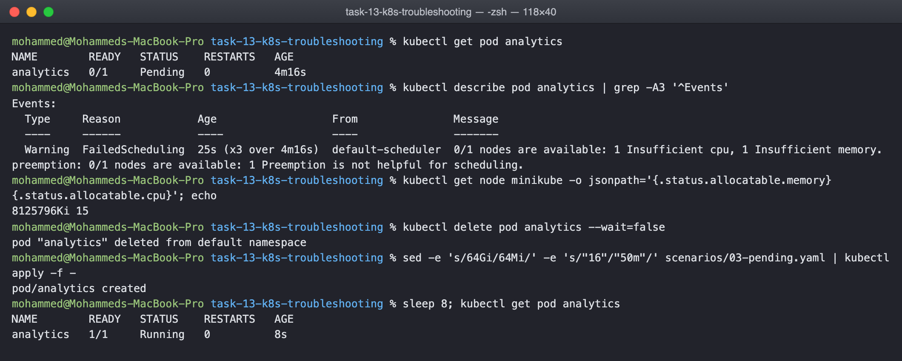

### ContainerCreating

Identify: stuck in ContainerCreating. Investigate: a FailedMount event, configmap
catalog-settigns not found. Root cause: the volume refers to a ConfigMap that does
not exist, misspelled. Fix: create the ConfigMap, or correct the name. Verify: Ready.

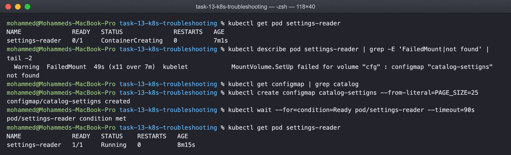

### Service with no endpoints

Identify: requests to the service time out although the pods are Running.
Investigate: kubectl get endpoints shows none, the service selector says
app=catalogue and the pods are labelled app=catalog. Root cause: the selector
matches nothing. Fix: patch the selector. Verify: endpoints appear and the request
returns the page.

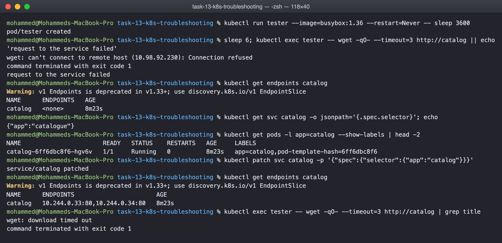

### DNS

Identify: the client logs say bad address catalog.library.svc.cluster.local.
Investigate: the service exists, in default, not in library, and the cluster DNS is
healthy because catalog.default and kubernetes.default both resolve. Root cause: a
correct name in the wrong namespace. Fix: use catalog.default.svc.cluster.local, or
just catalog from inside default.

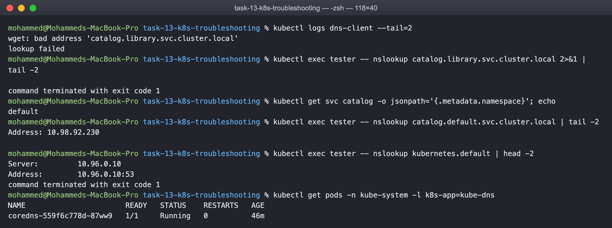

### Pod networking

Identify: the service has endpoints and DNS resolves, yet every connection is
refused. Investigate: the service targetPort is 8080 and the container listens on 80.
Root cause: traffic reaches the pod on a port nothing is listening on. Fix: patch
targetPort to 80. Verify: the page comes back.

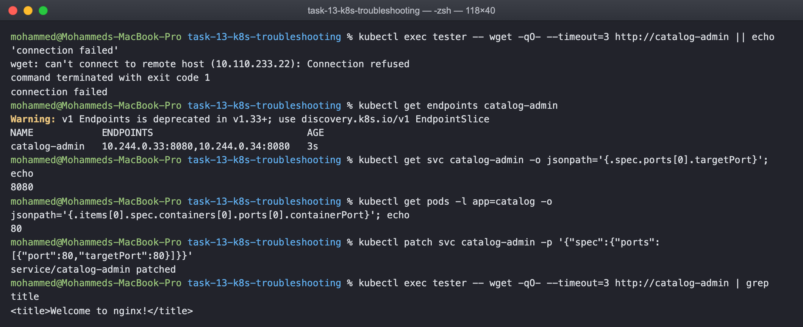

### Configuration

Identify: CreateContainerConfigError, which is neither a crash nor a pull problem.
Investigate: describe says couldn't find key DB_PASSWRD in Secret default/catalog-db.
Root cause: the env var refers to a key that does not exist in the secret. Fix: use
the key that does, DB_PASSWORD. Verify: Ready and the log line appears.

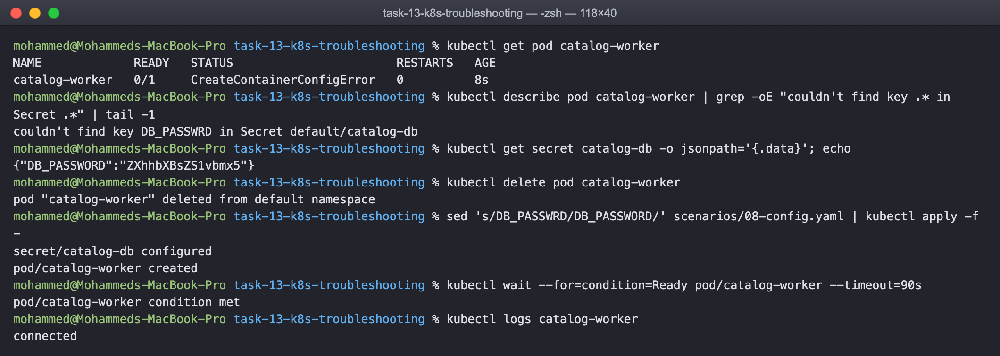

## Task 3: mini project

The library-web deployment and service in mini-project were deployed as handed over.
The pods ran, but the service returned nothing.

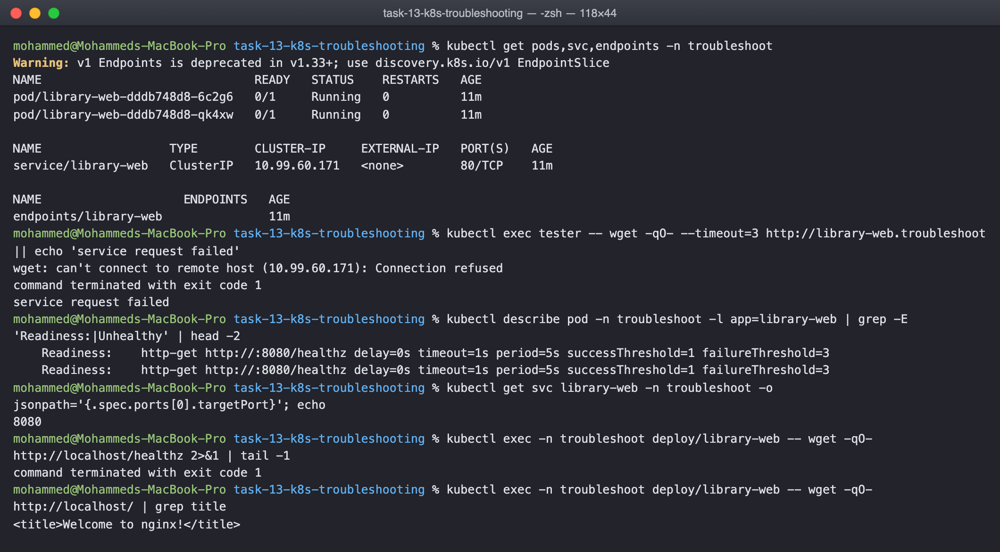

Two problems, found in that order. The pods were Running but 0/1 READY, and describe
showed the readiness probe hitting /healthz on port 8080, which nginx does not serve.
Because nothing was ready the endpoints list was empty. Then, even with ready pods,
the service targetPort was 8080 while the container listens on 80.

Fix both, probe to / on 80 and targetPort to 80, roll out, and the endpoints fill and
the page comes back:

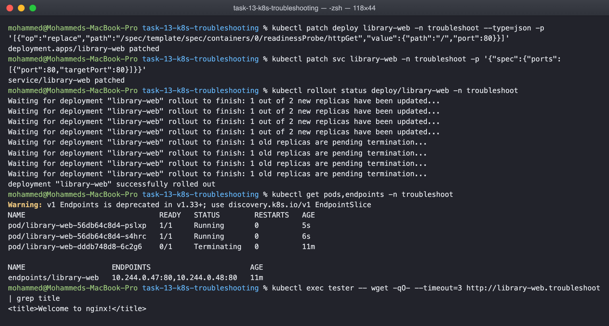

## What I understood

The status column narrows it down before any investigation. Pending is scheduling,
ContainerCreating is volumes or images, ImagePullBackOff is the registry,
CreateContainerConfigError is a missing ConfigMap or Secret key, CrashLoopBackOff is
the application itself. Running but 0/1 is a probe, and Running and ready but
unreachable is the service: the selector, the targetPort, or the name.

describe events and logs between them explain nearly everything, and the fix is
usually one field. The hard part is resisting the urge to restart things before
reading what Kubernetes already wrote down.
