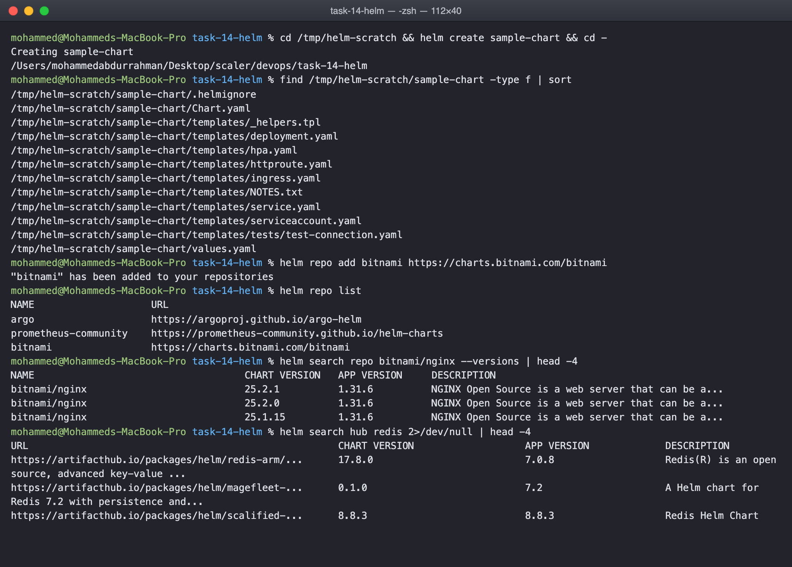
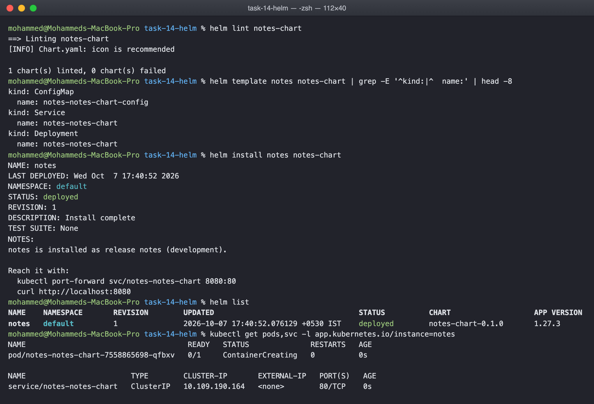
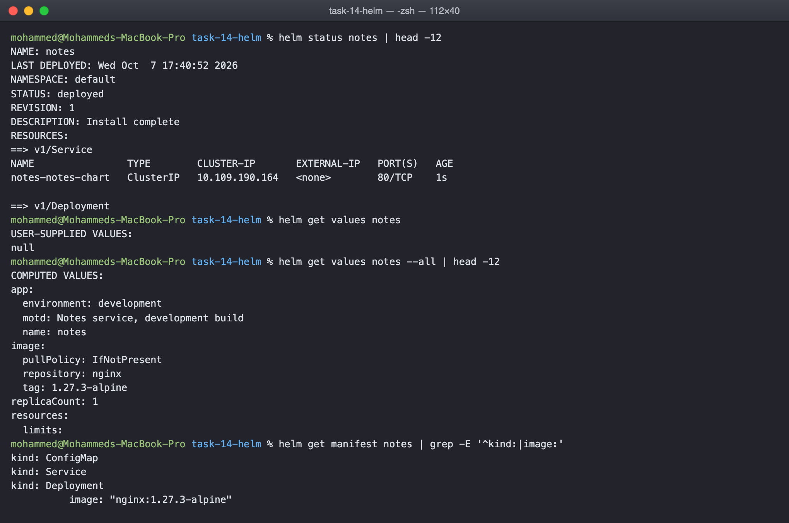
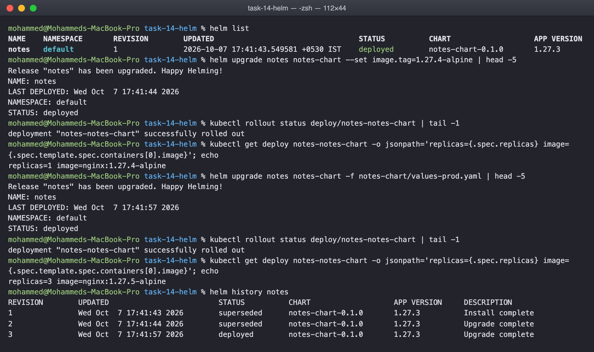
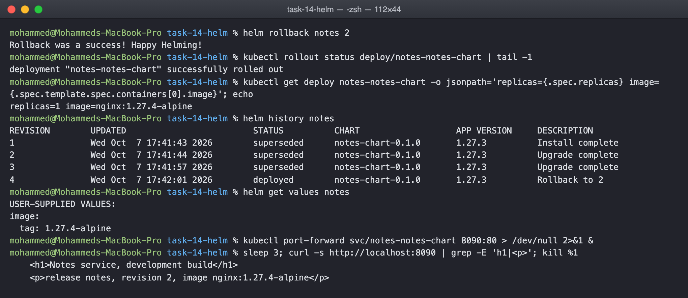
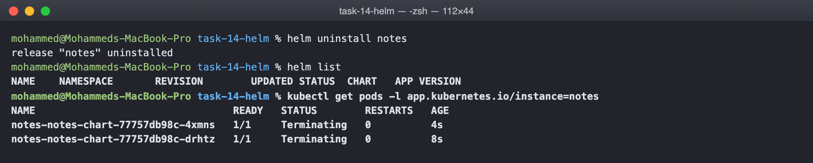

# Helm Homework

The chart is notes-chart, a small nginx service whose page, environment and replica
count all come from values. Task 1 runs through the Helm commands, Task 2 is the
install, upgrade, upgrade, rollback workflow, and Task 3 is the chart itself as the
mini project.

## The chart

    notes-chart/
      Chart.yaml           name, version 0.1.0, appVersion
      values.yaml          defaults: 1 replica, nginx 1.27.3-alpine, ClusterIP, development
      values-prod.yaml     overrides: 3 replicas, 1.27.5-alpine, NodePort, production
      templates/
        _helpers.tpl       the fullname and label helpers
        configmap.yaml     APP_NAME, ENVIRONMENT and the index.html the pods serve
        deployment.yaml    the pods, with a checksum annotation that rolls them when the configmap changes
        service.yaml       type and port from values
        NOTES.txt          printed after install

Every value a template reads has a default in values.yaml, so the chart installs with
no arguments, and anything can be overridden with --set or a second values file.

## Task 1: the commands

helm create writes a complete starter chart with a deployment, service, ingress,
HPA and helpers, which is the fastest way to see the expected layout. helm repo add
registers a chart repository, helm search repo looks through the ones added, and
helm search hub searches Artifact Hub:

helm lint checks the chart, helm template renders it without a cluster so you can
read what will be applied, helm install creates a release, helm list shows releases:

    $ helm install notes notes-chart
    NAME: notes
    STATUS: deployed
    REVISION: 1

helm status is the release's current state, helm get values shows what I supplied,
--all shows that merged with the defaults, and helm get manifest is the rendered
YAML that is actually in the cluster:

## Task 2: the rollback workflow

Install, then two upgrades, then a rollback, verifying the deployment after each.

Upgrade one changed only the image tag with --set. Upgrade two applied
values-prod.yaml, which changed replicas, image and service type at once:

    $ helm upgrade notes notes-chart --set image.tag=1.27.4-alpine
    replicas=1 image=nginx:1.27.4-alpine

    $ helm upgrade notes notes-chart -f notes-chart/values-prod.yaml
    replicas=3 image=nginx:1.27.5-alpine

    $ helm history notes
    REVISION   STATUS       DESCRIPTION
    1          superseded   Install complete
    2          superseded   Upgrade complete
    3          deployed     Upgrade complete

Then back to revision 2:

    $ helm rollback notes 2
    Rollback was a success! Happy Helming!
    replicas=1 image=nginx:1.27.4-alpine

    $ helm history notes
    REVISION   STATUS       DESCRIPTION
    1          superseded   Install complete
    2          superseded   Upgrade complete
    3          superseded   Upgrade complete
    4          deployed     Rollback to 2

    $ curl -s http://localhost:8090 | grep -E 'h1|
'
        <h1>Notes service, development build</h1>
        
release notes, revision 2, image nginx:1.27.4-alpine

Three things in that output. A rollback is a new revision, 4, not a deletion of 3,
so the history is never rewritten. helm get values after the rollback shows only
image.tag, which is exactly what revision 2 had been given, the production values are
gone. And the page served by the pods says revision 2, because Helm re rendered
revision 2's manifests, including its .Release.Revision, rather than reverting
anything by hand.

helm uninstall removes everything the release created:

## Task 3: mini project

The chart above is the mini project. The part I would point at is the
checksum/config annotation on the deployment's pod template. Without it, changing a
value that only affects the ConfigMap would update the ConfigMap and leave the
running pods serving the old page, because the pod template itself did not change.
With it, the hash of the rendered ConfigMap is part of the template, so any change
to the page rolls the pods.

## What I understood

A chart is a set of templates plus a values file, and a release is one installation
of it with one set of values. Helm keeps every revision of a release, which is what
makes upgrade and rollback cheap and safe. The commands split into ones that look,
list, status, get, history, template, and ones that change, install, upgrade,
rollback, uninstall, and the second group always produces a new revision.
