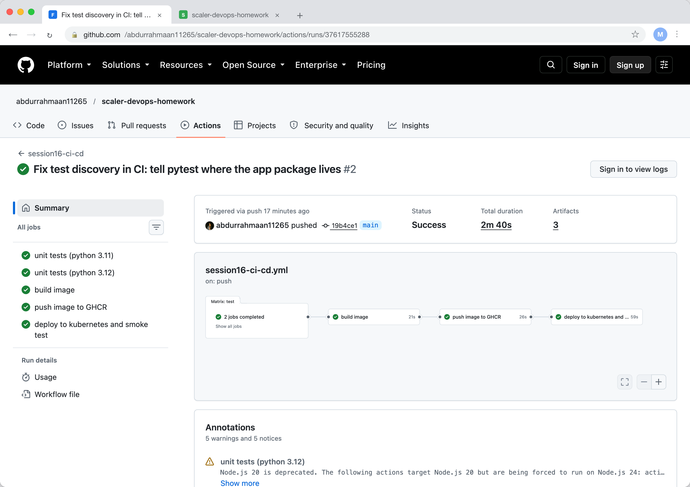
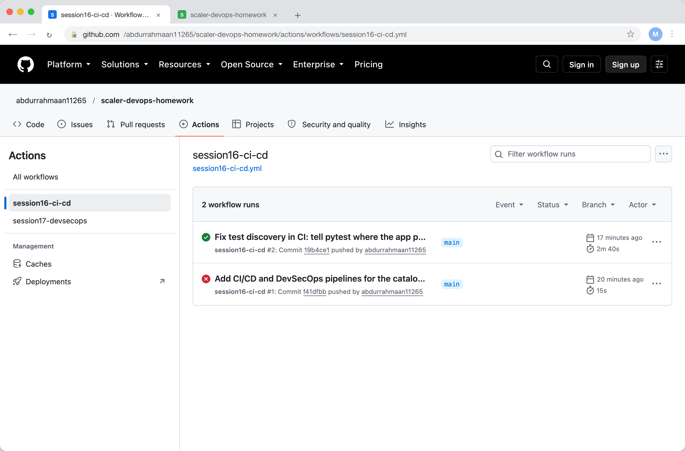

# CI/CD and GitHub Actions Homework

A small Flask service, the library catalog API, with a pipeline that tests it,
packages it, pushes the image and deploys it. The workflow file is
.github/workflows/session16-ci-cd.yml at the root of the repository, because GitHub
only runs workflows from there. Everything else is in this folder.

    task-15-cicd-github-actions/
      app/catalog.py          four endpoints: /health, /books, /books/<id>, borrow
      tests/test_catalog.py   five pytest cases
      requirements.txt        runtime dependencies
      requirements-dev.txt    the above plus pytest
      pytest.ini              tells pytest where the app package is
      Dockerfile              python:3.12-slim, gunicorn, non root user
      k8s/deployment.yaml     deployment and service, image replaced by the pipeline

## CI and CD

CI is everything that proves a change is good: run the tests, build the artifact.
CD is everything that takes a good change to an environment: publish the image,
deploy it, check it answers. In the workflow the first two jobs are CI and the last
two are CD, and CD never runs unless CI passed because each job has needs.

## The pipeline

    test  (python 3.11)  ─┐
    test  (python 3.12)  ─┴─> build ──> push ──> deploy

The workflow is one YAML file. It is triggered on push to main when anything in
this folder changes, and can also be started by hand with workflow_dispatch.

Jobs are the boxes above. Each runs on its own runner, a fresh ubuntu-latest VM
GitHub provides, so a job cannot see files another job made unless they are passed
as artifacts. Steps are the commands inside a job, run in order on the same runner.

The test job uses a matrix, so GitHub runs it twice in parallel, once per Python
version. Each run uploads its JUnit report as an artifact.

The build job builds the Docker image and saves it with docker save as a tar file,
which it uploads as an artifact. That is the handover between CI and CD: the push job
downloads that exact tar, so what is deployed is byte for byte what was tested.

Secrets. The push job logs in to GHCR with secrets.GITHUB_TOKEN, a token GitHub
creates for every run with just enough permission, here packages: write. The deploy
job reads secrets.DEPLOY_API_KEY, which I created on a staging environment in the
repository settings; the step prints its length, not its value, because GitHub
masks secrets in logs anyway.

The deploy job creates a kind cluster on the runner, applies k8s/deployment.yaml with
the image tag swapped for the commit SHA, waits for the rollout and curls /health and
/books through the service.

## Pipeline execution

The first run failed inside a minute. pytest on the runner could not import app,
because running pytest directly does not add the project root to the path the way
python -m pytest does on my laptop. A pytest.ini with pythonpath = . fixed it. That
is the kind of thing CI exists to catch, it worked on my machine.

The second run passed end to end: both test jobs, the build, the push to
ghcr.io/abdurrahmaan11265/catalog-api, and the deployment with a successful smoke
test, in 2m40s with 3 artifacts.

The image is public at ghcr.io/abdurrahmaan11265/catalog-api, tagged with the commit
SHA and with latest.

## What I understood

A workflow is just the steps I would run by hand, written down so the same thing
happens on every push with nobody remembering to do it. The design choices that
matter are the ones about trust: tests before build, the tested artifact being the
deployed artifact, and credentials coming from secrets rather than files. The matrix
and the parallel jobs are nice, but the needs chain is what makes it a pipeline
rather than a list of scripts.
