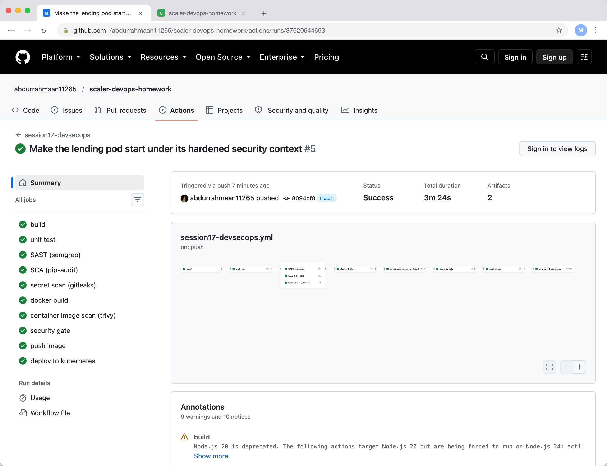
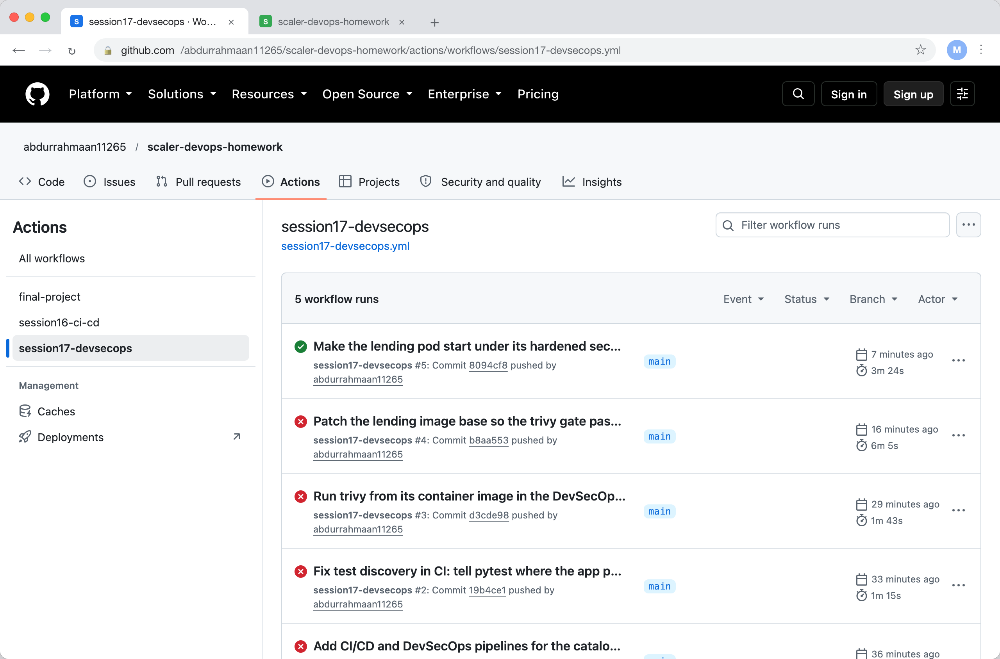
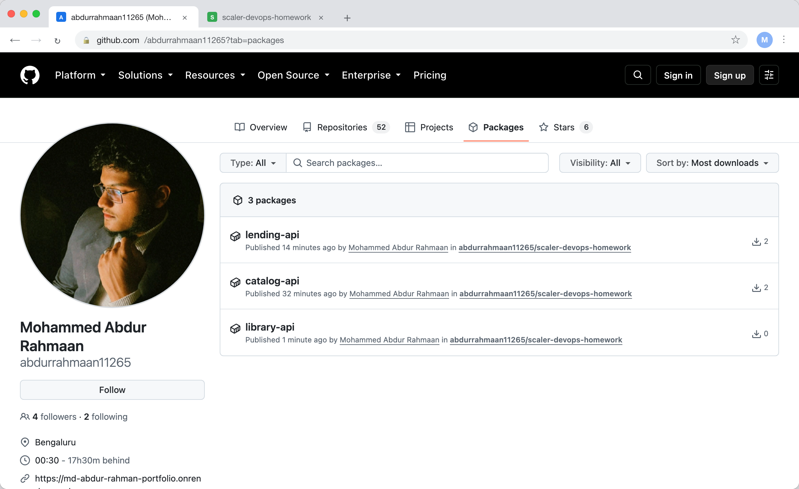

# Complete CI/CD and DevSecOps Homework

The lending API, a second Flask service, with a pipeline where every stage after
the unit tests is a security check that can stop the release. The workflow is
.github/workflows/session17-devsecops.yml at the repository root. The security tool
configuration is in the security folder here.

    task-16-devsecops/
      app/lending.py          the service: /health, GET/POST/DELETE /loans/<member>
      tests/test_lending.py   five pytest cases
      Dockerfile              patched base image, non root uid 1000, healthcheck
      k8s/deployment.yaml     hardened pod: non root, read only root filesystem, no privilege escalation
      security/semgrep.yml    SAST rules on top of the p/python and p/flask rulesets
      security/gitleaks.toml  secret scanning config
      security/trivy.yaml     image scan policy: fail on fixable HIGH or CRITICAL

## The flow

    build -> unit test -> SAST -> SCA -> secret scan -> docker build
          -> image scan -> security gate -> push image -> deploy to kubernetes

SAST, SCA and the secret scan run in parallel after the tests, and the docker build
needs all three. The image scan needs the build. The gate needs the scan. Push needs
the gate and deploy needs push. A failure anywhere stops everything downstream.

SAST is semgrep, static analysis of the source for dangerous patterns, with the
registry's Python and Flask rulesets plus one rule of mine that forbids starting the
Flask debug server.

SCA is pip-audit, which checks every pinned dependency against the vulnerability
databases. It fails on any known CVE.

Secret scanning is gitleaks over the full git history, so a credential that was
committed and then removed is still caught.

Container image scanning is trivy over the built image tar, with the policy in
security/trivy.yaml. It fails on HIGH or CRITICAL findings that have a fix
available, and reports the rest without blocking.

The security gate is the job that only runs if all four passed. It does nothing but
exist, and push and deploy depend on it, which is what makes the scans gates rather
than reports.

Push logs in to GHCR with the run's own token and pushes the image tagged with the
commit SHA and latest. Deploy brings up a kind cluster on the runner, applies the
manifest with that SHA, waits for the rollout, and exercises the API.

## What the gates actually caught

This is the part worth reading, because the pipeline did not pass on the first try
and every failure was real.

Before the first push, pip-audit run locally found that flask 3.0.3 had a known
vulnerability, PYSEC-2026-2151, fixed in 3.1.3. The SCA gate would have failed. I
bumped the pin and the audit came back clean.

Run 1 failed in the unit test job: pytest on the runner could not import the app
package. A pytest.ini with pythonpath fixed it.

Run 2 reached the image scan and failed because the pinned trivy action tag no
longer existed. I switched to running the trivy CLI from its own container image.

Run 3 passed every scan up to the image scan, and the image scan failed the gate:
20 fixable HIGH and CRITICAL findings in the debian packages of python:3.12-slim,
which lags behind debian's security updates. Nothing to do with my code. Adding
apt-get upgrade to the Dockerfile cleared every fixable finding, and trivy exited 0.

Run 4 passed the gate, pushed the image, and failed at deploy: the rollout timed
out. The pod spec sets runAsNonRoot, which Kubernetes can only verify if the uid is a
number, and readOnlyRootFilesystem, under which gunicorn cannot write its heartbeat
files to /tmp. The Dockerfile now creates uid 1000 explicitly and the pod mounts an
emptyDir at /tmp. I verified it locally with docker run --read-only before pushing.

Run 5 passed end to end.

The published images, catalog-api from the previous task and lending-api from this
one:

## Running the scanners locally

The same four tools run on a laptop before a push, which is how the flask finding
was caught before it ever reached CI:

    semgrep scan --config p/python --config security/semgrep.yml app
    pip-audit -r requirements.txt --strict
    gitleaks dir . --config security/gitleaks.toml
    trivy image --config security/trivy.yaml --ignore-unfixed lending-api:local

## What I understood

A security gate is only a gate if something depends on it. Scans that run and post
a report get ignored; scans that the push job needs cannot be. The cost is that the
pipeline fails for reasons that are not bugs in the code, a base image that is a
week behind, an action tag that was removed, and the fixes for those are part of
the job. Of the five failures here, one was a test setup mistake and four were the
pipeline doing exactly what it was for.

The hardening in the pod spec, non root and read only, is cheap to write and
genuinely changes what a compromised container can do, but it has to be tested the
same way as everything else, because an application that assumes it can write
anywhere will not start under it.
