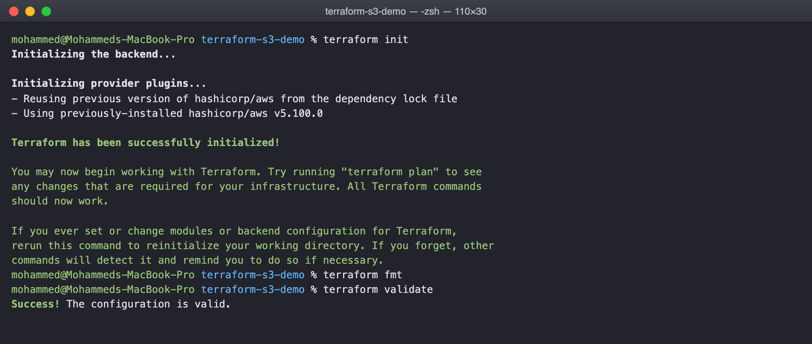
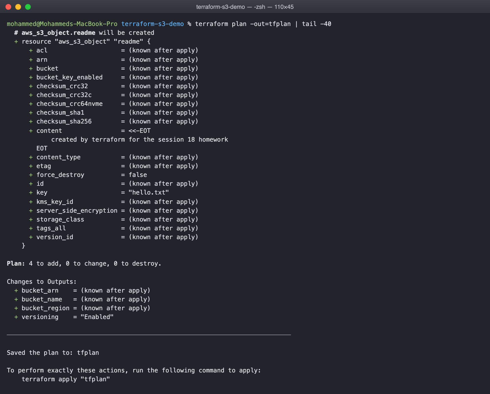
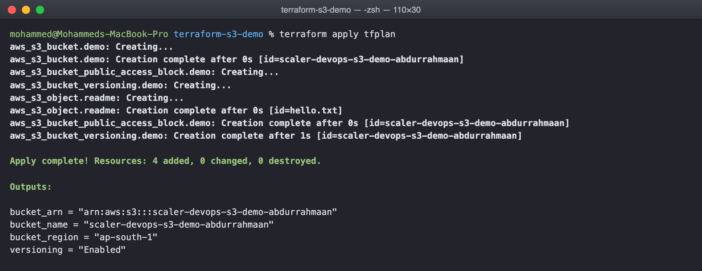
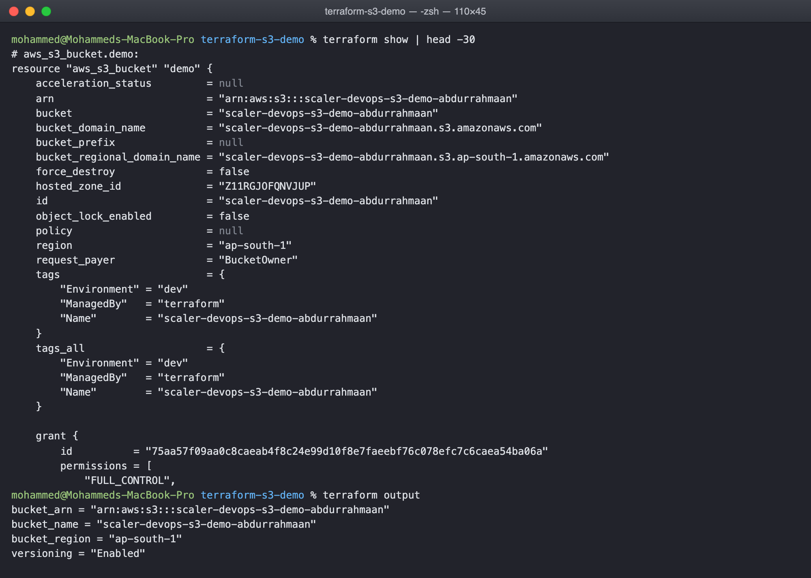
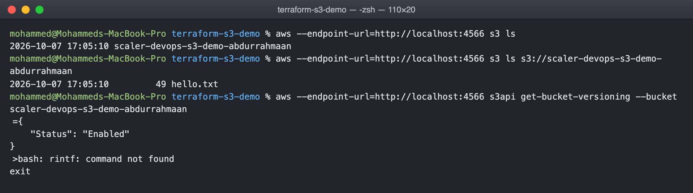
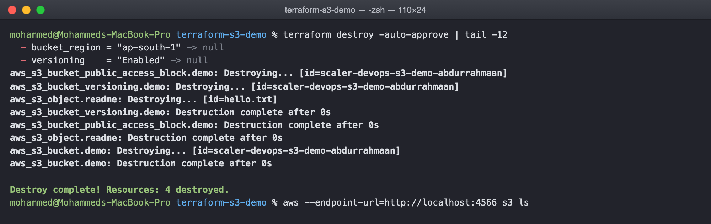

# Terraform and Infrastructure as Code Homework

Task 1 is the S3 bucket project in terraform-s3-demo, run through the full
init, fmt, validate, plan, apply, show, output and destroy workflow. Task 2 is the
AWS services research in aws-services, one README per service.

## Where the AWS was

I do not have a personal AWS account, and the only credentials on this laptop belong
to my employer, so I ran everything against LocalStack, an AWS emulator that runs in
Docker and answers the same API on localhost:4566.

    docker run -d --name localstack -p 4566:4566 -e SERVICES=s3,ec2,iam,sts localstack/localstack:4.9

The Terraform files are the same ones you would use for real AWS. The only
LocalStack specific part is the endpoints block in provider.tf, which points the
provider at localhost instead of amazonaws.com, and the dummy test credentials. Remove
that block and run aws configure and the same project creates a real bucket.

## Task 1: terraform-s3-demo

    terraform-s3-demo/
      provider.tf         terraform and provider blocks, pinned to aws ~> 5.0
      variables.tf        region, bucket name, environment, versioning flag
      terraform.tfvars    the values for this run
      main.tf             the bucket, versioning, public access block, one object
      outputs.tf          name, arn, region, versioning status

The bucket itself is four resources, not one. In the current provider the bucket is
bare and versioning, public access and so on are separate resources that reference
it, which is also how Terraform knows the order to create them in.

### init, fmt, validate

    $ terraform init
    Terraform has been successfully initialized!
    $ terraform fmt
    $ terraform validate
    Success! The configuration is valid.

init downloads the provider into .terraform and writes the lock file. fmt rewrites
the files into the canonical style and prints the names of any it changed, nothing
here because they were already formatted. validate checks syntax and references
without talking to any API.

### plan

    $ terraform plan -out=tfplan
    Plan: 4 to add, 0 to change, 0 to destroy.

The plan shows every attribute of every resource it is going to create, with
known after apply for anything the API decides, such as the bucket's ARN. Saving it
with -out means apply does exactly this plan and nothing else, even if the files
change in between.

### apply

    $ terraform apply tfplan
    aws_s3_bucket.demo: Creating...
    aws_s3_bucket.demo: Creation complete after 0s [id=scaler-devops-s3-demo-abdurrahmaan]
    aws_s3_bucket_public_access_block.demo: Creating...
    aws_s3_bucket_versioning.demo: Creating...
    aws_s3_object.readme: Creating...
    Apply complete! Resources: 4 added, 0 changed, 0 destroyed.

The bucket was created first and the other three only after it, in parallel with
each other, because they all reference the bucket and nothing references them.

### show and output

    $ terraform show | head -30
    # aws_s3_bucket.demo:
    resource "aws_s3_bucket" "demo" {
        arn    = "arn:aws:s3:::scaler-devops-s3-demo-abdurrahmaan"
        bucket = "scaler-devops-s3-demo-abdurrahmaan"
        ...

    $ terraform output
    bucket_arn = "arn:aws:s3:::scaler-devops-s3-demo-abdurrahmaan"
    bucket_name = "scaler-devops-s3-demo-abdurrahmaan"
    bucket_region = "ap-south-1"
    versioning = "Enabled"

show prints the state file in readable form, so it includes everything the API
returned, not just what I wrote. output prints only the values declared in
outputs.tf, which is what another tool or person would consume.

Checking from outside Terraform that the bucket really exists:

    $ aws --endpoint-url=http://localhost:4566 s3 ls
    2026-10-07 17:03:42 scaler-devops-s3-demo-abdurrahmaan
    $ aws --endpoint-url=http://localhost:4566 s3 ls s3://scaler-devops-s3-demo-abdurrahmaan
    2026-10-07 17:03:42         49 hello.txt

### destroy

    $ terraform destroy -auto-approve
    Destroy complete! Resources: 4 destroyed.
    $ aws --endpoint-url=http://localhost:4566 s3 ls

The bucket listing is empty afterwards. Destroy walks the dependency graph in
reverse, deleting the object and the configuration resources before the bucket.

## Task 2: AWS services research

    aws-services/01-iam/README.md            users, groups, roles, policies, least privilege
    aws-services/02-ec2/README.md            AMIs, instance types, key pairs, security groups, EBS, lifecycle
    aws-services/03-s3/README.md             buckets, objects, storage classes, versioning, lifecycle, encryption
    aws-services/04-vpc/README.md            CIDR, subnets, route tables, gateways, security groups vs NACLs
    aws-services/05-dynamodb-rds/README.md   DynamoDB keys and items, RDS engines, Multi-AZ, read replicas

## What I understood

Terraform turns infrastructure into a file that can be reviewed, versioned and
applied the same way every time, and the state file is what makes that possible. It
is the record of what Terraform believes exists, which is why plan can say exactly
what will change and destroy can remove everything it created and nothing else. The
workflow is always the same six commands, and apply is the only one that costs
anything or changes anything.
