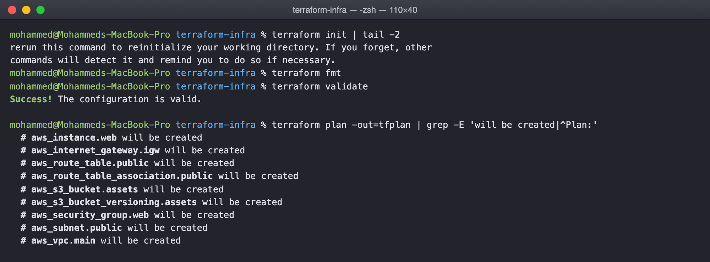
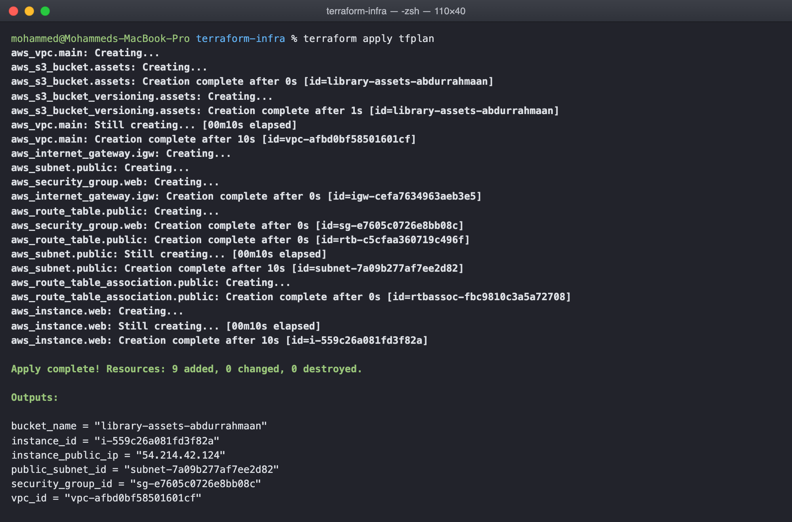
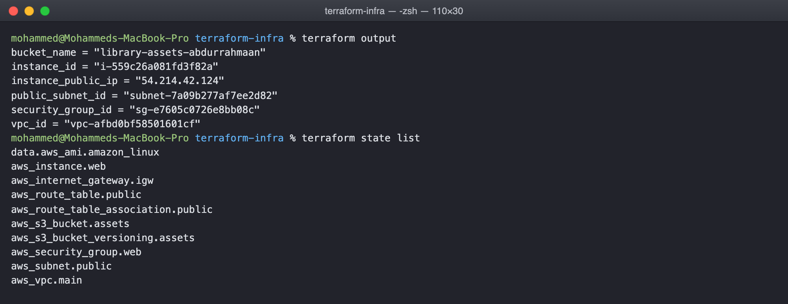
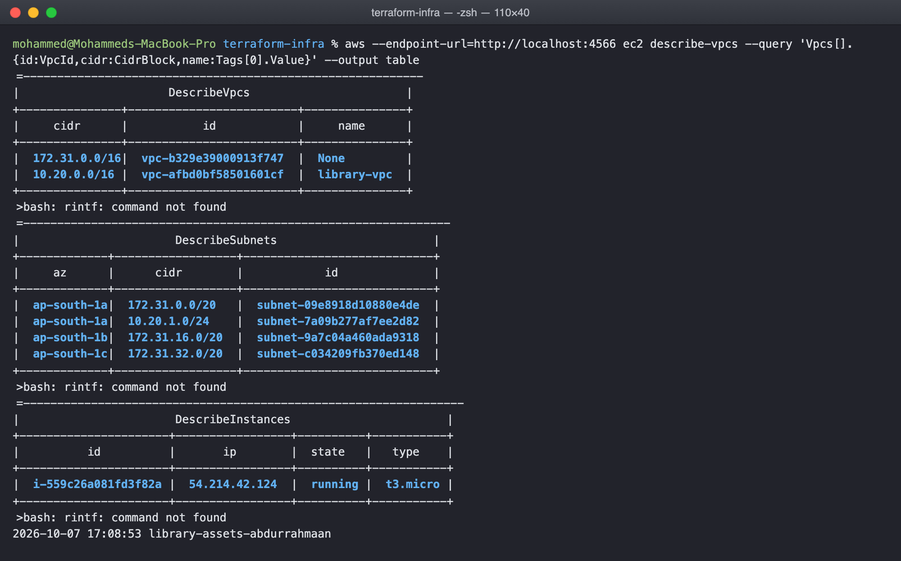
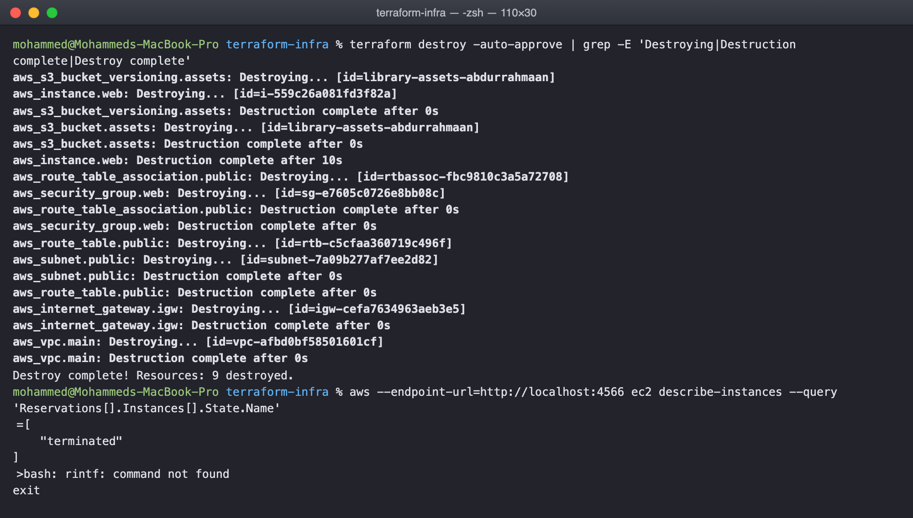

# Cloud and Terraform in Action Homework

An end to end piece of AWS infrastructure built with Terraform: a VPC with a public
subnet and internet access, a security group, a web server in the subnet, and an S3
bucket for its assets. The project is in terraform-infra.

As in the previous task, this was run against LocalStack rather than a real AWS
account because the only AWS credentials on this machine are my employer's. The
provider.tf endpoints block is the only LocalStack specific part; the resources,
variables, outputs and dependencies are exactly what real AWS would take.

## Architecture

    Internet
       |
       v
    Internet Gateway  (aws_internet_gateway.igw)
       |
       v
    +-------------------------------------------------------+
    |  VPC  10.20.0.0/16                 aws_vpc.main        |
    |                                                       |
    |   Route table  0.0.0.0/0 -> igw    aws_route_table    |
    |         |                                             |
    |         v                                             |
    |   Public subnet  10.20.1.0/24      aws_subnet.public  |
    |         |                                             |
    |         v                                             |
    |   Security group  80 from any,     aws_security_group |
    |                   22 from allowed  .web               |
    |         |                                             |
    |         v                                             |
    |   EC2  t3.micro, nginx via         aws_instance.web   |
    |        user_data                                      |
    +-------------------------------------------------------+

    S3 bucket  library-assets-abdurrahmaan   aws_s3_bucket.assets
               versioning enabled

## Files

    terraform-infra/
      versions.tf        required terraform and provider versions
      provider.tf        region, credentials, LocalStack endpoints
      variables.tf       region, project name, CIDRs, instance type, ssh range, bucket
      terraform.tfvars   the values for this run
      main.tf            the nine resources above
      outputs.tf         ids and the instance public IP

## How the pieces depend on each other

Most dependencies are implicit. The subnet references aws_vpc.main.id, so Terraform
knows the VPC comes first. The route table references the gateway, the association
references both the subnet and the table, the instance references the subnet and the
security group. Terraform builds the graph from those references and creates things
in the right order, in parallel where it can.

One dependency is explicit. The instance has depends_on the route table association,
because its user_data script installs nginx from the internet and that only works
once the subnet actually has a route out. Nothing in the instance's attributes refers
to the route table, so without depends_on Terraform could create the instance first.

The AMI is a data source, not a hard coded id:

    data "aws_ami" "amazon_linux" {
      most_recent = true
      owners      = ["amazon"]
      filter {
        name   = "name"
        values = ["al2023-ami-*-x86_64"]
      }
    }

That lookup runs during plan, which is why the plan already shows the exact ami id.

## Workflow

    $ terraform init
    $ terraform fmt
    $ terraform validate
    Success! The configuration is valid.

    $ terraform plan -out=tfplan
      # aws_instance.web will be created
      # aws_internet_gateway.igw will be created
      # aws_route_table.public will be created
      # aws_route_table_association.public will be created
      # aws_s3_bucket.assets will be created
      # aws_s3_bucket_versioning.assets will be created
      # aws_security_group.web will be created
      # aws_subnet.public will be created
      # aws_vpc.main will be created
    Plan: 9 to add, 0 to change, 0 to destroy.

    $ terraform apply tfplan
    aws_vpc.main: Creating...
    aws_s3_bucket.assets: Creating...
    ...
    aws_instance.web: Creation complete
    Apply complete! Resources: 9 added, 0 changed, 0 destroyed.

The order in the apply output is the dependency graph made visible: the VPC and the
bucket start together because neither depends on anything, then the subnet, gateway
and security group, then the route table, then the association, and the instance
last.

    $ terraform output
    $ terraform state list

state list is the inventory of everything Terraform is managing, nine resources plus
the data source. Terraform state is the file that makes plan and destroy possible.
It is local here, terraform.tfstate, and is in .gitignore because it contains every
attribute of every resource. On a team it goes in a remote backend such as S3 with
locking.

Checking the resources through the AWS CLI, independently of Terraform:

    $ terraform destroy -auto-approve
    Destroy complete! Resources: 9 destroyed.

Destroy runs the graph backwards, instance first and VPC last, and the instance
afterwards shows as terminated.

## What I understood

A VPC is nothing until it has a subnet, a route to a gateway and a firewall, and
Terraform makes those relationships explicit in a way the console never does. The
references between resources are the design. Reading main.tf top to bottom is reading
the network diagram, and the plan output is the diagram checked against reality
before anything is built.
