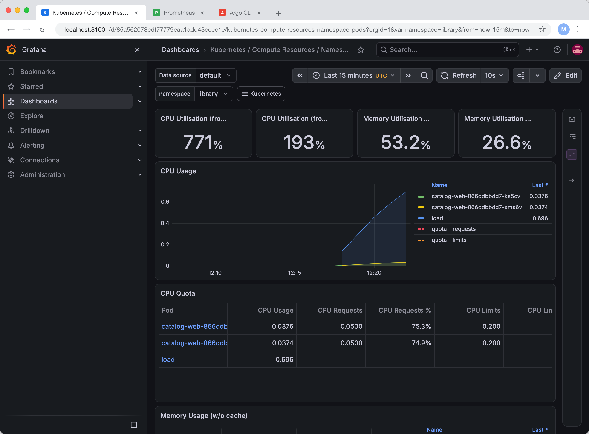
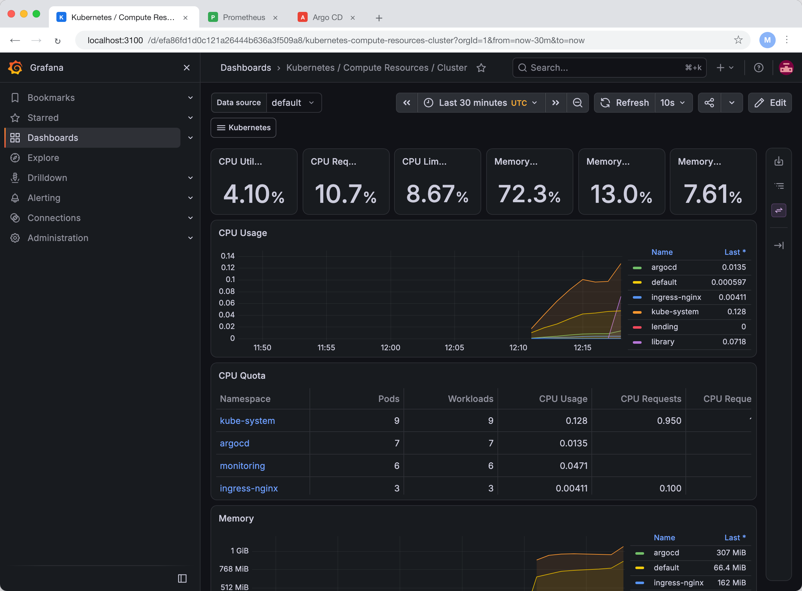
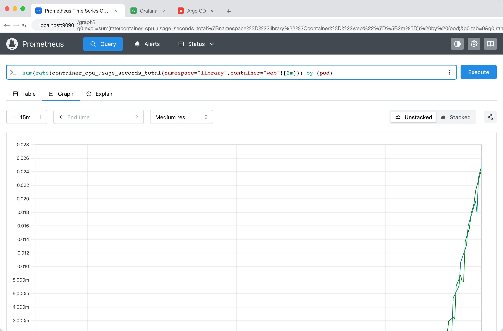
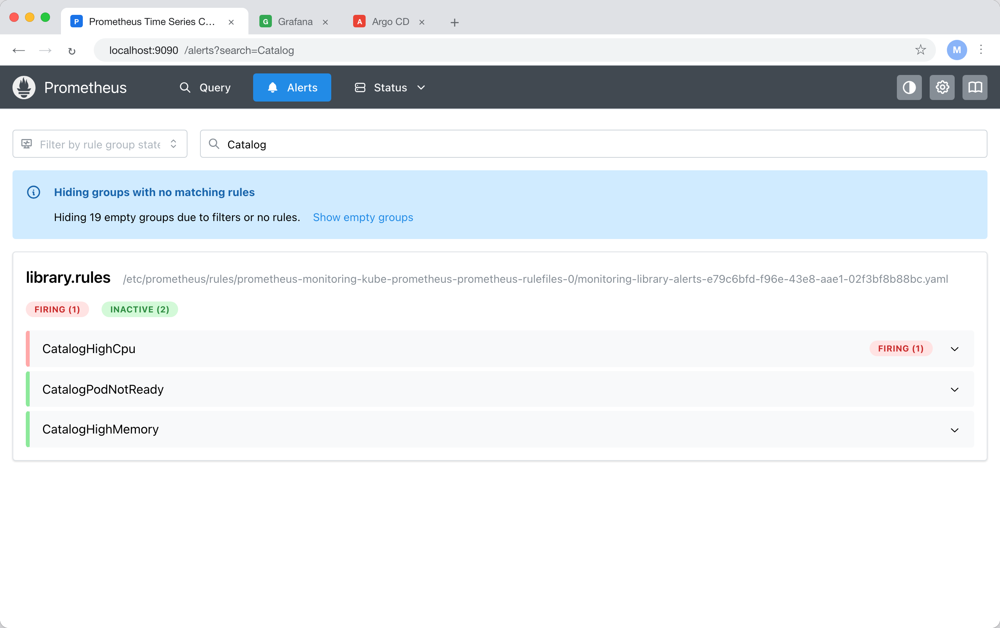
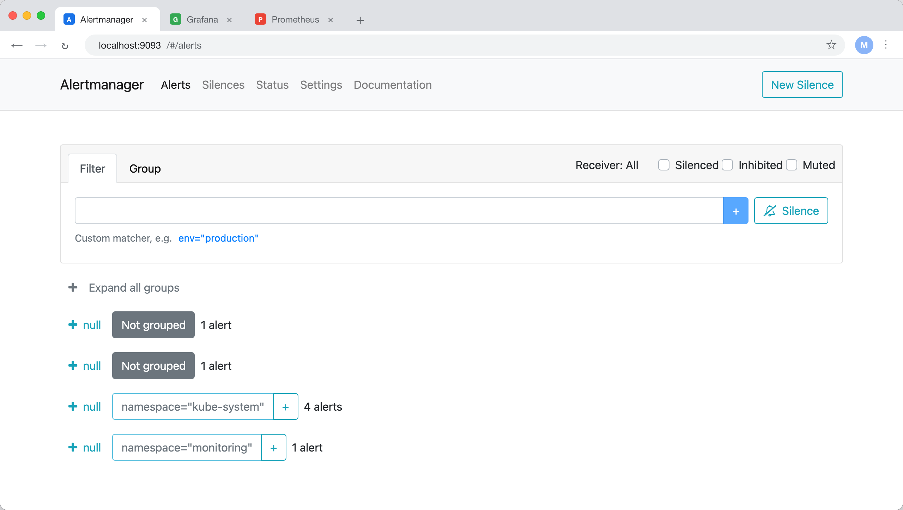
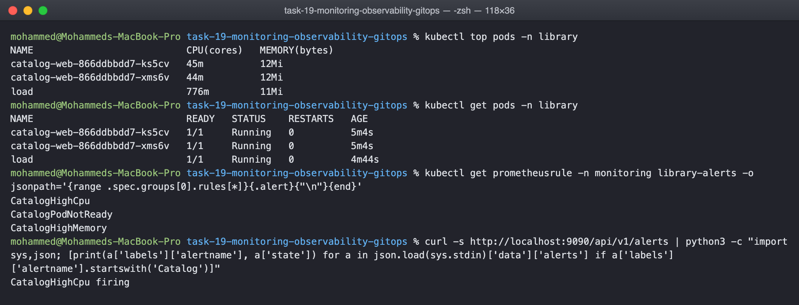
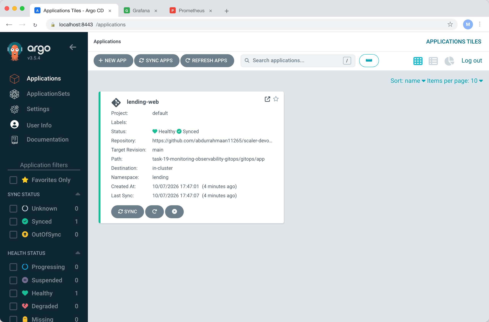
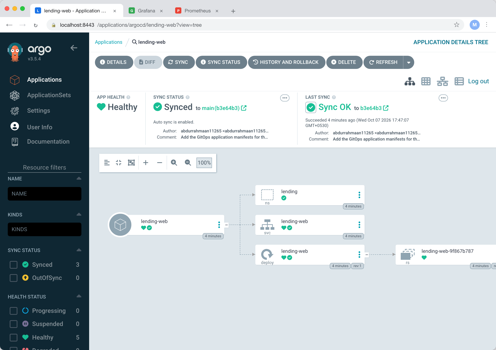
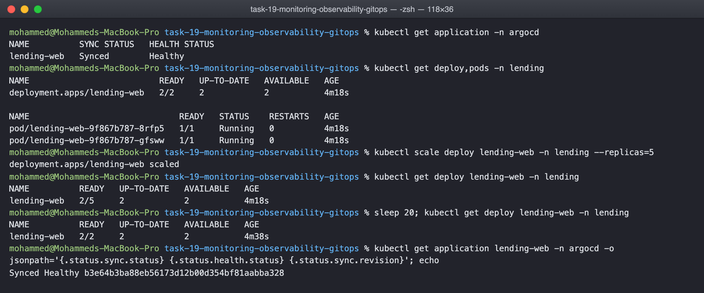

# Monitoring, Observability and GitOps Homework

Three parts on the same minikube cluster. Monitoring is a Prometheus and Grafana
stack watching a small deployment, with alert rules that actually fire. Observability
is the write up of the three pillars. GitOps is Argo CD keeping a namespace in sync
with a folder in this repository, including undoing a change I made by hand.

## Task 1: monitoring

The stack is kube-prometheus-stack from the prometheus-community Helm chart, which
installs Prometheus, Alertmanager, Grafana, node-exporter, kube-state-metrics and the
operator that wires them together:

    helm repo add prometheus-community https://prometheus-community.github.io/helm-charts
    helm install monitoring prometheus-community/kube-prometheus-stack -n monitoring --create-namespace

The workload being watched is monitoring/demo-app.yaml, two nginx replicas in a
library namespace with CPU and memory requests and limits and both probes.
monitoring/alert-rules.yaml adds three alerts as a PrometheusRule, and
monitoring/load.yaml is a busybox pod that hammers the service so there is
something to see.

### Metrics

The Grafana namespace dashboard, filtered to library, with the load running. CPU
usage sits just under the 50m request per pod and memory at about half the limit:

The cluster level view of the same data:

The same CPU series straight from Prometheus, which is what Grafana is drawing:

    sum(rate(container_cpu_usage_seconds_total{namespace="library", container="web"}[2m])) by (pod)

From the command line, kubectl top gives the same numbers metrics-server sees:

    $ kubectl top pods -n library
    NAME                           CPU(cores)   MEMORY(bytes)
    catalog-web-866ddbbdd7-ks5cv   45m          12Mi
    catalog-web-866ddbbdd7-xms6v   44m          12Mi
    load                           776m         11Mi

### Logs

kubectl logs is the log pipeline on a cluster this size. The catalog pods log every
request from the load generator to stdout, which is where a container's logs have to
go for Kubernetes to collect them. The usual next step is a shipper such as Loki or
Fluent Bit reading those same streams off the node and indexing them, so a line can
be searched across all pods rather than one at a time.

### Alerts

Three rules in monitoring/alert-rules.yaml: CPU above 80 percent of the request for
a minute, fewer than two replicas available for two minutes, memory above 90 percent
of the limit. With the load running, the CPU rule crossed its threshold and after the
one minute hold went to firing:

    $ curl -s http://localhost:9090/api/v1/alerts | ...
    CatalogHighCpu firing

Prometheus hands firing alerts to Alertmanager, which is where they would be routed
to Slack or a pager. Here it has no receiver configured, so they are visible and go
nowhere:

### Application health

The readiness and liveness probes on the deployment are what Kubernetes itself uses
for health, and kube-state-metrics exports their result, which is what the
CatalogPodNotReady rule reads. So probe failures become metrics, and metrics become
alerts, with nothing else to install.

## Task 2: observability

Monitoring tells you something is wrong. Observability is being able to find out why
from the outside, without adding code or redeploying, and it rests on three kinds of
data.

Metrics are numbers over time: CPU, request rate, error count, queue length. They are
cheap to store, easy to graph and the only thing you can alert on sensibly. They tell
you that something changed and roughly where, but not why.

Logs are the events a program writes as it runs. They have the detail metrics lack,
the exact request that failed and the stack trace, at the cost of volume. Structured
logs, one JSON object per line, are what make them searchable at scale.

Traces follow one request across every service it touches, with timing for each hop.
They answer the question metrics and logs cannot, which service in a chain of ten
made this request slow.

Observability is required because in a distributed system most failures are not in
the component that reports them. A slow database shows up as timeouts in the API and
errors in the frontend. Without being able to go from the symptom in one place to the
cause in another, every incident is a guess.

Common tools: Prometheus and Grafana for metrics, Loki, Elasticsearch or Fluent Bit
for logs, Jaeger or Tempo for traces, with OpenTelemetry as the common instrumentation
layer that feeds all three. Datadog and New Relic bundle the whole thing as a service.

On Kubernetes the pattern is that the platform already produces most of the signals.
kubelet and cAdvisor expose CPU and memory, kube-state-metrics exposes object state,
every container's stdout is a log stream on the node, and probes are a health signal
built in. The stack installed above collects the first three without touching the
application. Traces are the one pillar the application has to produce itself.

## Task 3: GitOps

GitOps means the Git repository is the source of truth for what should be running,
and a controller in the cluster keeps the cluster matching it. Nobody runs kubectl
apply. You change a file, merge it, and the controller notices.

The desired state is declarative, the YAML in gitops/app, a namespace, a two replica
deployment and a service. The controller is Argo CD, installed from its manifests
into the argocd namespace. gitops/argocd-application.yaml tells it which repository
and path to watch and that it may sync on its own:

    syncPolicy:
      automated:
        prune: true          # delete things removed from git
        selfHeal: true       # undo manual changes made in the cluster

Once the manifests were pushed and the Application applied, Argo CD pulled the path,
created the namespace, deployment and service, and reported Synced and Healthy
against the exact commit:

The workflow is: edit a manifest, commit, push. Argo CD polls the repository, sees the
new commit, diffs it against the cluster and applies the difference. The sync status
and the commit it is synced to are both visible on the application.

Continuous reconciliation is the part worth seeing. I scaled the deployment by hand to
five replicas, which is exactly the kind of drift GitOps is meant to prevent:

    $ kubectl scale deploy lending-web -n lending --replicas=5
    deployment.apps/lending-web scaled
    $ kubectl get deploy lending-web -n lending
    NAME          READY   UP-TO-DATE   AVAILABLE   AGE
    lending-web   2/5     2            2           4m18s

    $ sleep 20; kubectl get deploy lending-web -n lending
    NAME          READY   UP-TO-DATE   AVAILABLE   AGE
    lending-web   2/2     2            2           4m38s

Within twenty seconds the deployment was back to two replicas, because Git says two
and selfHeal is on. The change I made was never recorded anywhere, so it was treated
as drift and removed. To actually run five replicas I would change the file and push.

## What I understood

Monitoring and GitOps are the same idea pointed in different directions. Monitoring
compares what is happening to what should be happening and raises an alert on the
difference. GitOps compares what is deployed to what is declared and corrects the
difference. Both depend on the desired state being written down somewhere a machine
can read it, which is the real discipline, and both make the cluster something you
observe and declare against rather than something you log into and poke.
