# Final DevOps Project: the Library API

One application taken through everything in the course. The library API keeps a
catalogue of books on a persistent volume, takes its settings from a ConfigMap and
its admin token from a Secret, scales on CPU, exposes Prometheus metrics, is built
and scanned by GitHub Actions, published to GHCR, packaged as a Helm chart, deployed
to Kubernetes by Argo CD from this repository, and runs on infrastructure described
in Terraform. Then I broke it three ways and fixed it.

Screenshots referenced below are in ../screenshots.

## Project overview

    final-devops-project/
      application/    Flask API, tests, requirements
      docker/         Dockerfile and a compose file for local runs
      kubernetes/     plain manifests: namespace, configmap, secret, pvc, deployment, service, ingress, hpa
      helm/           the chart that owns the real deployment, plus ServiceMonitor and alert rules
      terraform/      VPC, subnet, internet gateway, route table, security group, EC2, S3
      .github/        the pipeline (the live copy is .github/workflows/final-project.yml at the repo root)
      security/       semgrep rules, gitleaks config, trivy policy
      monitoring/     the rendered ServiceMonitor and PrometheusRule
      gitops/         the Argo CD Application
      troubleshooting/ three deliberately broken manifests

## Architecture

    developer ──git push──> GitHub ──> GitHub Actions
                                         │ test, SAST, SCA, secret scan
                                         │ docker build, image scan, gate
                                         ▼
                                      ghcr.io/abdurrahmaan11265/library-api
                                         │
         Argo CD ◄──watches helm/library-api in this repo
            │ syncs
            ▼
    ┌─────────────────────────── Kubernetes (minikube) ───────────────────────────┐
    │  ingress library.local ──> service ──> deployment (2..5 pods via HPA)        │
    │                                           │ env from ConfigMap + Secret      │
    │                                           │ /data from PersistentVolumeClaim │
    │                                           │ /metrics scraped by Prometheus   │
    │  Prometheus + Alertmanager + Grafana (kube-prometheus-stack)                 │
    └──────────────────────────────────────────────────────────────────────────────┘

    Terraform ──> VPC 10.30.0.0/16 ──> public subnet ──> security group ──> EC2
              └─> S3 bucket (versioned)                      (against LocalStack)

## Technologies used

Python 3.12, Flask, gunicorn, prometheus-client, pytest. Docker. Kubernetes 1.37 on
minikube with the nginx ingress controller and metrics-server. Helm 4. GitHub Actions
with semgrep, pip-audit, gitleaks and trivy. GHCR. Argo CD 3.5. kube-prometheus-stack
(Prometheus, Alertmanager, Grafana). Terraform 1.16 with the AWS provider, run
against LocalStack because the only AWS credentials on this laptop are my employer's.

## Application setup

    cd application
    pip install -r requirements-dev.txt
    pytest -v                     # 7 tests
    ADMIN_TOKEN=dev flask --app app.main run

Endpoints: GET /health, GET /ready, GET /books, POST /books (needs X-Admin-Token),
POST /books/<id>/borrow, GET /metrics. Books are stored as JSON under DATA_DIR.

## Docker setup

    docker build -f docker/Dockerfile -t library-api:local .
    docker compose -f docker/docker-compose.yml up --build

The image patches the base distribution, runs as uid 1000, has a HEALTHCHECK, and
works with a read only root filesystem as long as /tmp is writable.

## Kubernetes deployment

kubernetes/ holds the plain manifests, applied in order. The Secret file is a
placeholder; the real token is created at deploy time. The chart below renders the
same objects and is what actually runs, so the folder is there to read.

Every requirement is in 04-deployment.yaml: envFrom the ConfigMap and the Secret, the
PVC mounted at /data, startup, readiness and liveness probes, requests and limits,
and a hardened securityContext. The HPA scales between 2 and 5 at 60 percent CPU,
and the Ingress routes library.local to the service.

## Helm deployment

    helm install library-api helm/library-api -n library --create-namespace \
      --set secret.adminToken=$(openssl rand -hex 12)

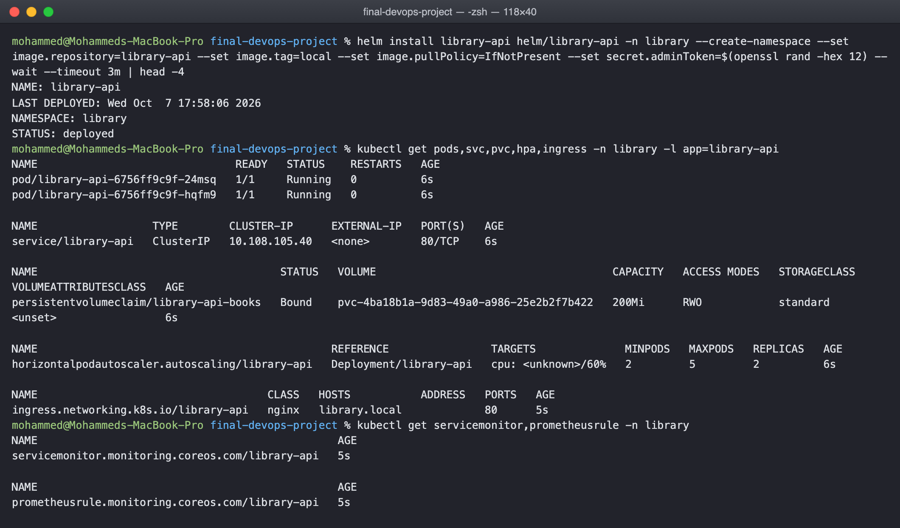

The chart adds two things the plain manifests do not: a ServiceMonitor so Prometheus
scrapes /metrics, and a PrometheusRule with three alerts. A checksum annotation rolls
the pods when the ConfigMap changes.

Smoke test through a port forward, adding a book with the token and reading the
metrics the request produced:

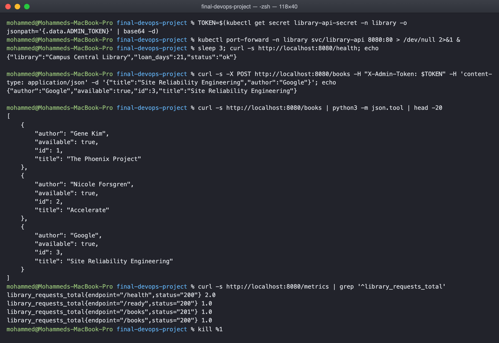

Through the ingress, and the storage test, both pods deleted and the books still
there afterwards:

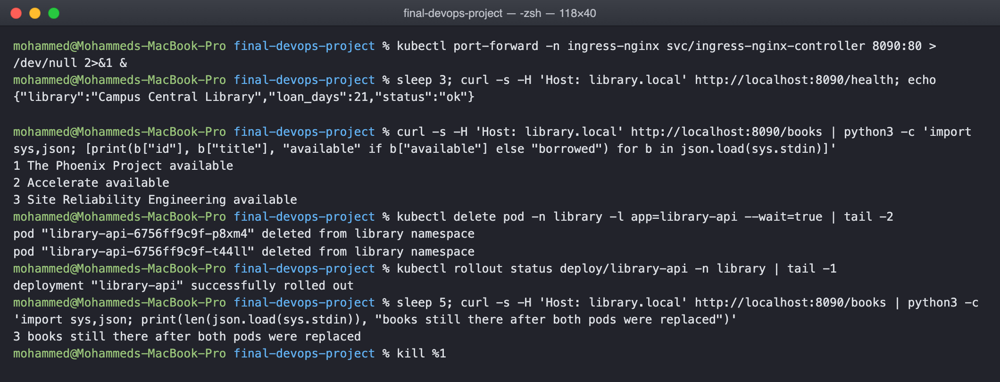

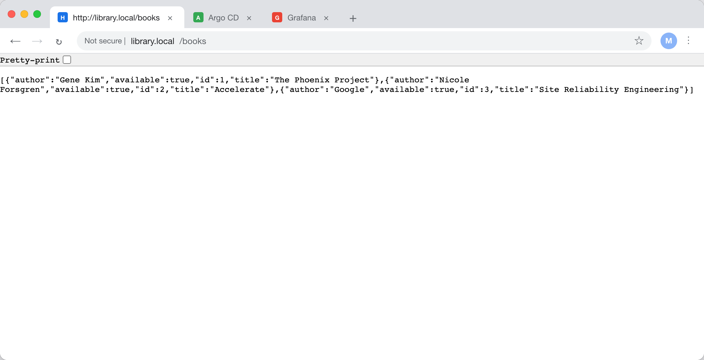

## Terraform infrastructure

    cd terraform && terraform init && terraform plan -out=tfplan && terraform apply tfplan

Nine resources: VPC, subnet, internet gateway, route table and association,
security group, an EC2 instance that installs nginx from user_data, and a versioned
S3 bucket. The instance depends on the route table association explicitly because
its boot script needs the internet.

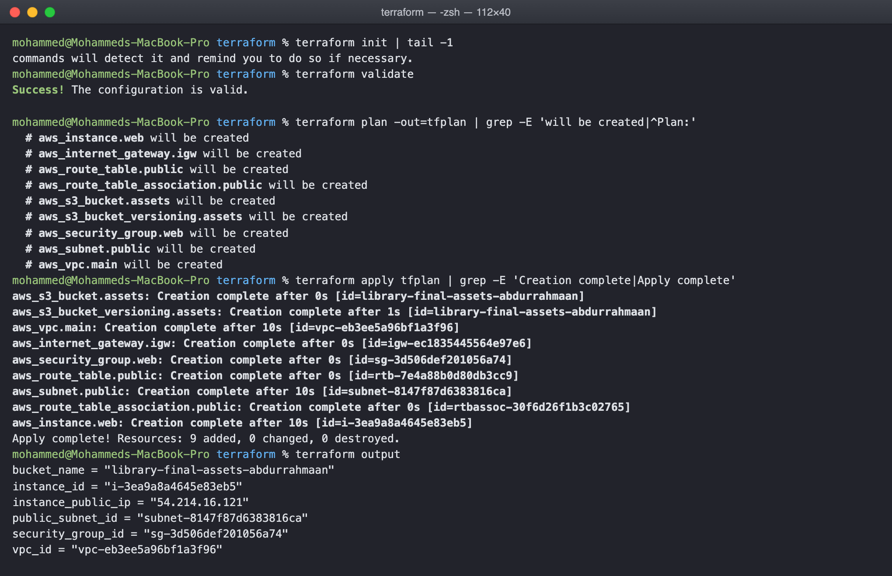

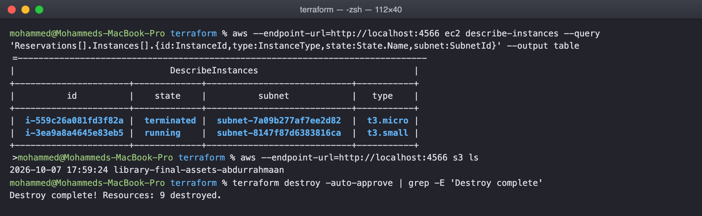

## CI/CD pipeline

.github/workflows/final-project.yml, triggered by any push that touches this folder:

    build and unit test ──> SAST ──┐
                        ──> SCA  ──┼──> docker build ──> image scan ──> security gate
                        ──> secret scan ┘                                     │
                                                       deploy with helm ◄── push image

The deploy job creates a kind cluster on the runner, installs this chart with the
image tagged by the commit SHA and the admin token from a GitHub environment secret,
then adds a book and reads the metrics. It passed on the first run:

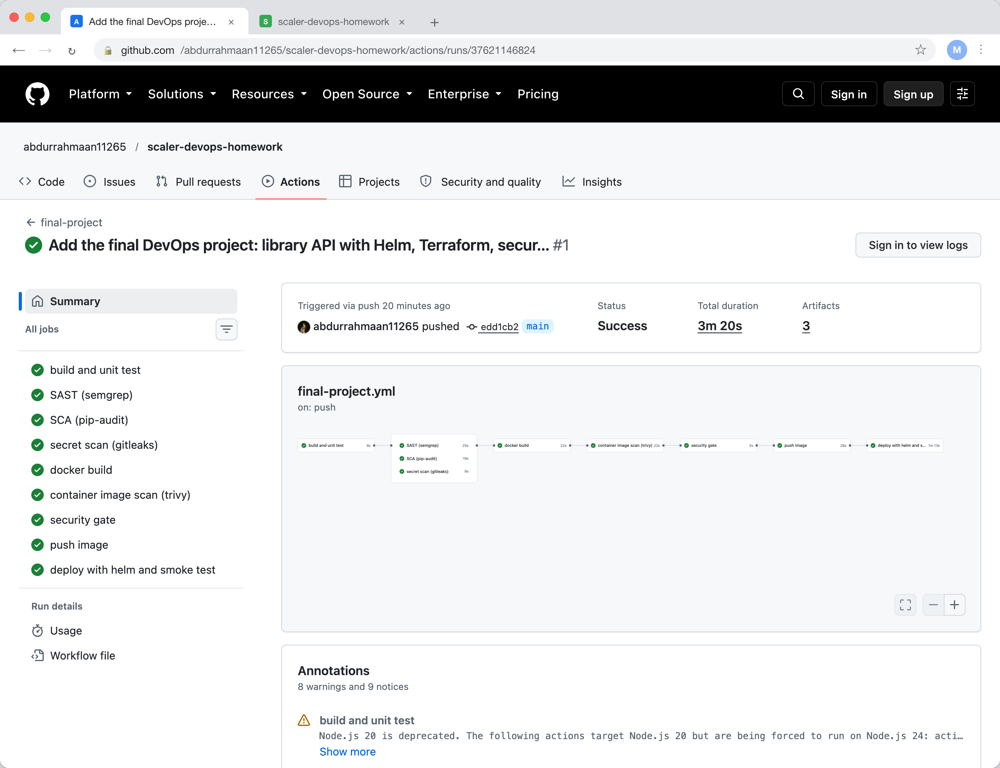

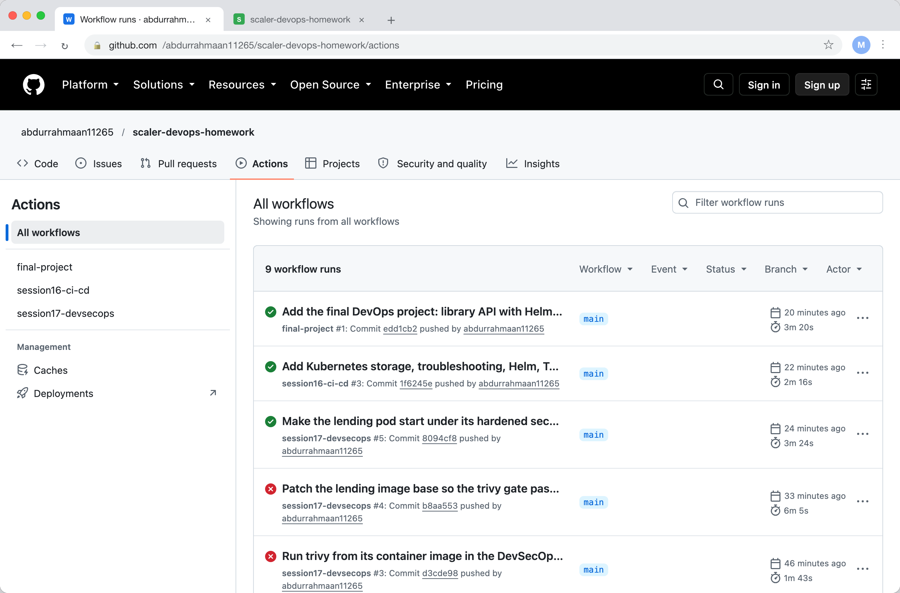

## DevSecOps implementation

SAST is semgrep with the Python and Flask rulesets plus security/semgrep.yml. SCA is
pip-audit with --strict. Secret scanning is gitleaks over the whole history with
security/gitleaks.toml. Image scanning is trivy with security/trivy.yaml, failing on
fixable HIGH or CRITICAL findings. The security gate job depends on all of them and
push depends on the gate, so none of the scans are advisory.

The base image patch in the Dockerfile exists because the trivy gate failed on the
stock python:3.12-slim in the previous session's pipeline.

## Monitoring

The ServiceMonitor labels the service for the Prometheus operator, which scrapes
/metrics every 15 seconds. library_requests_total is a counter by route and status
and library_request_seconds a latency histogram. The alerts are LibraryApiDown,
LibraryApiErrorRate above 5 percent, and LibraryApiHighCpu above 80 percent of the
request.

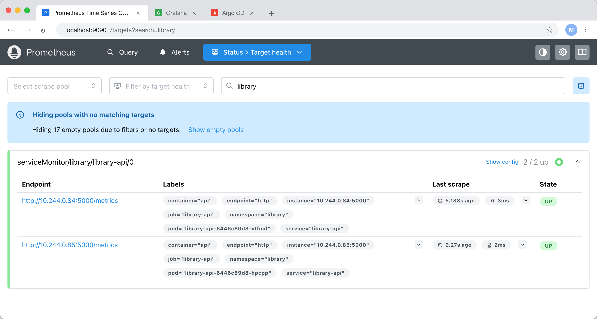

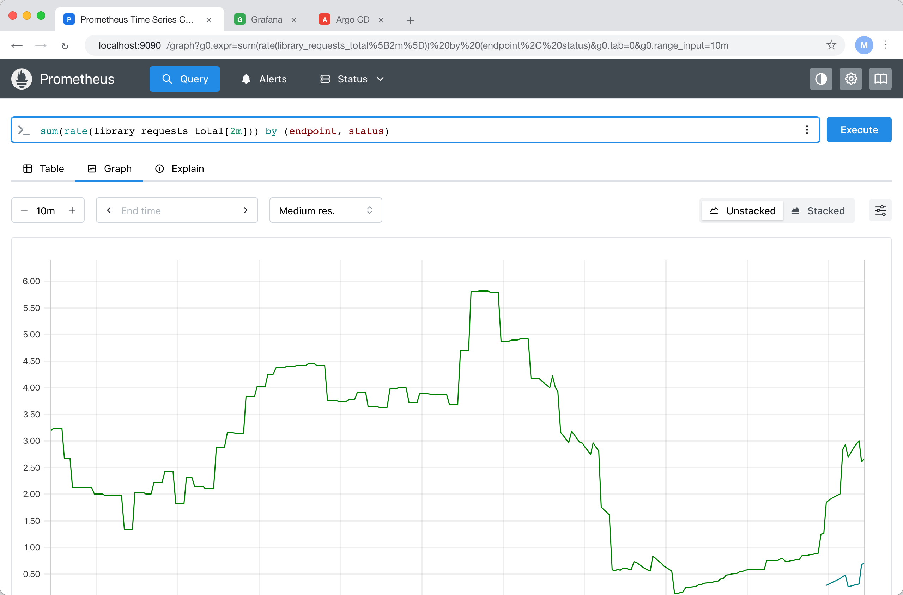

One thing the first scrape taught me: the application originally labelled its counter
by endpoint, and Prometheus attaches its own endpoint label, the scraped port name,
to every series from a ServiceMonitor. The target label won and every request looked
like it came from a route called http. Renaming the label to route fixed it.

## GitOps

gitops/argocd-application.yaml points Argo CD at helm/library-api in this repository
with automated sync, prune and self heal. The admin token is passed as a Helm
parameter on the Application rather than committed. After the pipeline pushed the
image, the Application was created and Argo CD installed the chart from git:

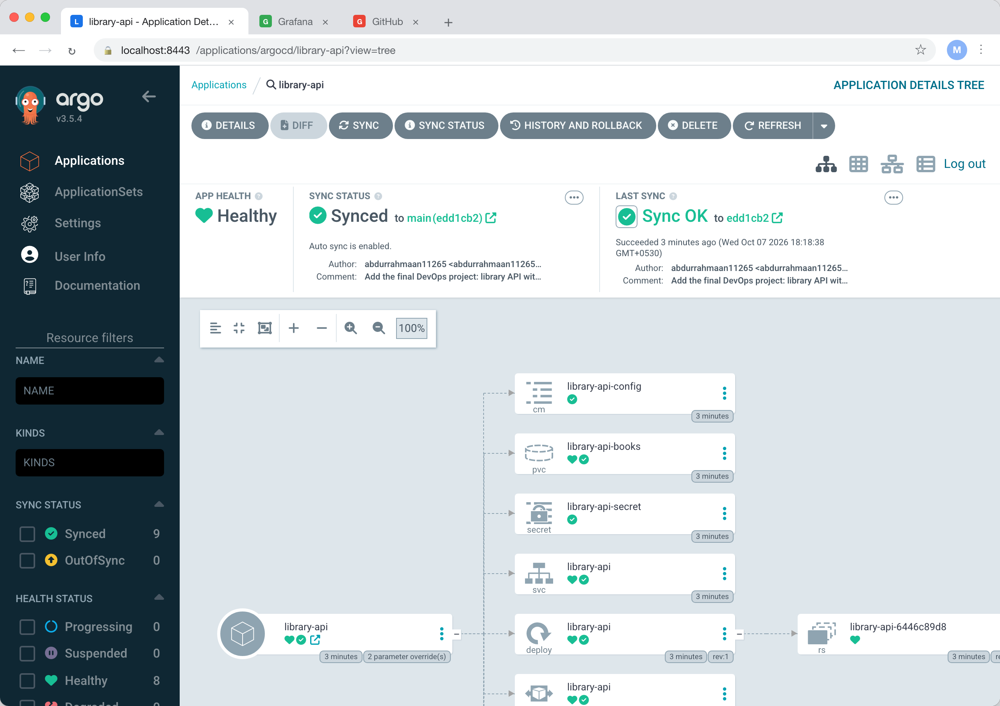

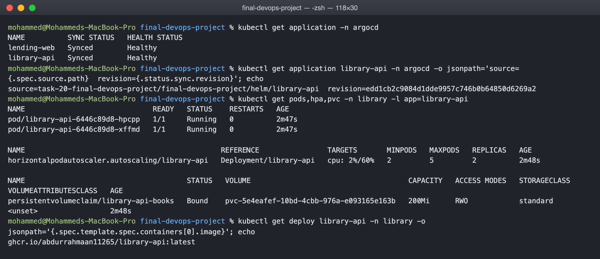

The deployment now runs ghcr.io/abdurrahmaan11265/library-api:latest, the image the
pipeline built, from manifests Argo CD rendered from the commit shown on the
Application. A manual change to any of it would be reverted within a minute.

## Troubleshooting

Three breaks from the troubleshooting folder, each applied to the running deployment
with kubectl patch and taken through identify, investigate, root cause, fix, verify.

Break 1, wrong secret key. The new pod goes to CreateContainerConfigError. describe
says couldn't find key ADMIN_TOKN in Secret library/library-api-secret. The secret has
ADMIN_TOKEN. Removing the bad env entry restores the template and the rollout
completes:

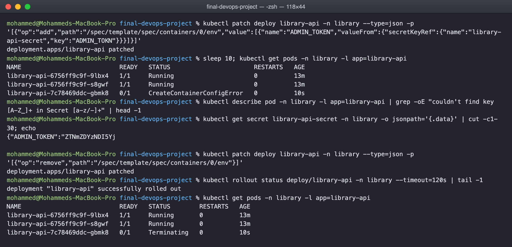

Break 2, readiness probe on port 8080. The new pod is Running but 0/1 and never joins
the endpoints. Because this is a rolling update, the two old pods keep serving, so the
ingress never returned an error; the failure is only visible in the pod status and
the endpoints list, which is why a bad probe can hide for a long time. Pointing the
probe back at the named http port fixes it:

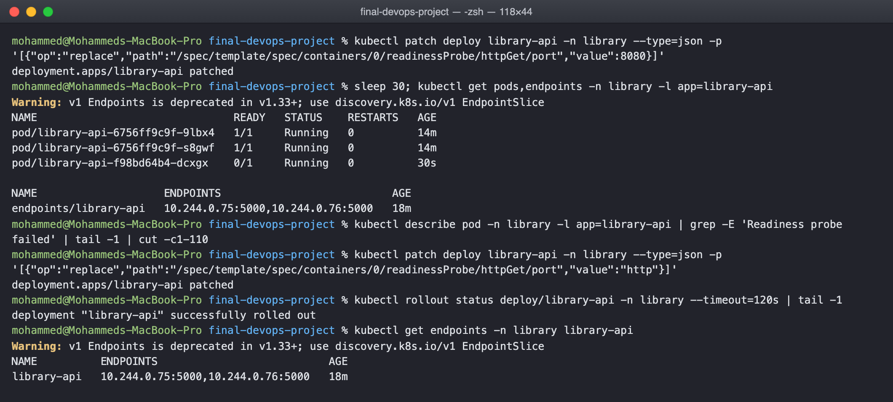

Break 3, an image tag that was never pushed. ImagePullBackOff on the new pod, old
pods unaffected. describe names the tag. Setting the image back fixes it:

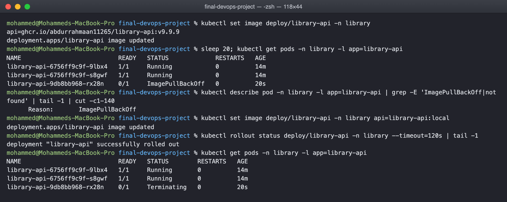

In all three cases the deployment's rolling update meant the service stayed up while
the broken version failed to become ready. That is the behaviour the probes and
maxUnavailable buy you, and it is also why watching rollout status matters, because
nothing else will tell you the new version never arrived.

## Screenshots

    01-helm-install.png            chart installed, all objects present
    02-api-smoke-test.png          health, add a book, list, metrics
    03-terraform-apply.png         plan and apply of the nine resources
    04-terraform-verify-destroy.png resources seen through the aws cli, then destroyed
    05-ingress-and-persistence.png access through the ingress, pods replaced, data intact
    06-api-through-ingress.png     the API in a browser at library.local
    07..09                         the three troubleshooting breaks and fixes
    10-pipeline-success.png        the GitHub Actions run
    11-all-workflows.png           every pipeline in the repository
    12-commit-history.png          the commit history
    13-argocd-library-api.png      Argo CD application tree
    14-argocd-cli.png              the same from kubectl
    15-prometheus-app-metrics.png  library_requests_total by route and status
    16-prometheus-target.png       the ServiceMonitor target being scraped

## Lessons learned

Everything that failed in this project failed at a boundary between two tools: pytest
on a runner that does not set the path the way my laptop does, a security context
that needs a numeric uid, a read only filesystem that an application assumed it could
write to, a Prometheus label that collided with the application's, a Helm rollback
that cannot remove a field it never owned. None of it was in the code. The value of
building the whole chain is finding those boundaries before they matter.

The other lesson is that the declarative pieces reinforce each other. The chart is
the one description of the deployment, the pipeline deploys exactly that chart, Argo
CD keeps the cluster matching it, and the probes and HPA keep the application
matching what the chart says. Each layer makes the one below it harder to get wrong
by hand.
