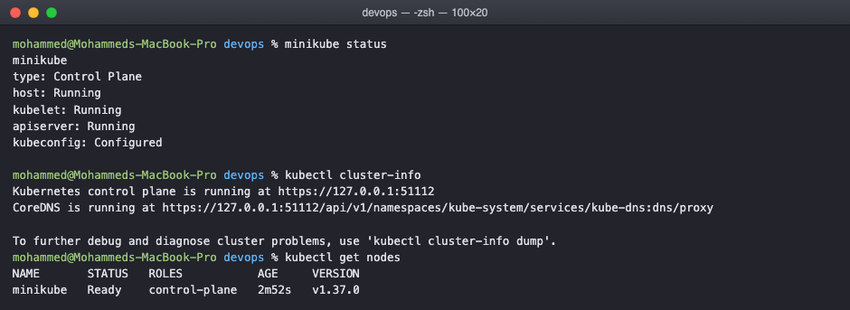
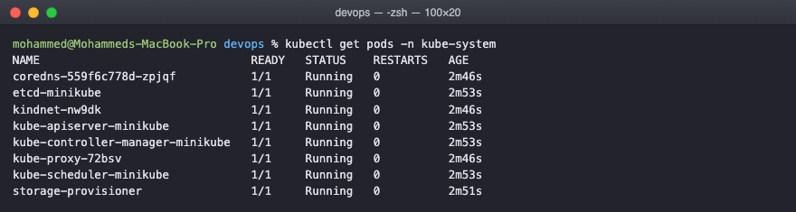
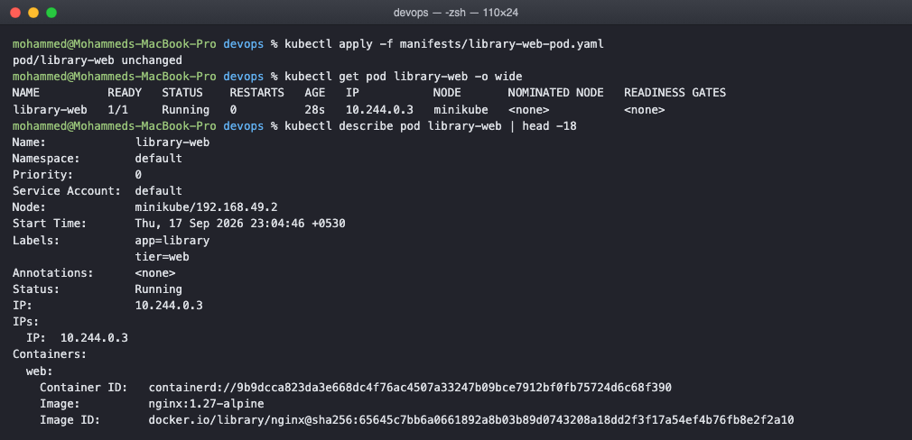
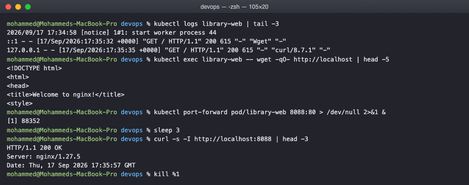

# Kubernetes Basics Homework

Getting a cluster running on my laptop, understanding what the pieces are, and running
the first pod. Everything below was actually run and the output is copied as it appeared.

## Setting up the cluster

I used minikube, which runs a single node cluster inside a Docker container. On a Mac
with Apple silicon the docker driver is the one that works without a separate VM.

    brew install minikube
    minikube start --driver=docker

That takes a few minutes the first time because it downloads a node image of about
470 MB and the Kubernetes binaries on top of that.

    $ minikube status
    minikube
    type: Control Plane
    host: Running
    kubelet: Running
    apiserver: Running
    kubeconfig: Configured

    $ kubectl cluster-info
    Kubernetes control plane is running at https://127.0.0.1:51112
    CoreDNS is running at https://127.0.0.1:51112/api/v1/namespaces/kube-system/services/kube-dns:dns/proxy

    $ kubectl get nodes
    NAME       STATUS   ROLES           AGE    VERSION
    minikube   Ready    control-plane   2m52s   v1.37.0

The node says control-plane and nothing else because this is a single node cluster. On a
real cluster you would see several worker nodes here with no role listed.

## What the cluster is actually made of

The kube-system namespace is where Kubernetes runs itself, so listing it shows the
architecture rather than just describing it:

    $ kubectl get pods -n kube-system
    NAME                               READY   STATUS    RESTARTS   AGE
    coredns-559f6c778d-zpjqf           1/1     Running   0          4m31s
    etcd-minikube                      1/1     Running   0          4m38s
    kindnet-nw9dk                      1/1     Running   0          4m31s
    kube-apiserver-minikube            1/1     Running   0          4m38s
    kube-controller-manager-minikube   1/1     Running   0          4m38s
    kube-proxy-72bsv                   1/1     Running   0          4m31s
    kube-scheduler-minikube            1/1     Running   0          4m38s
    storage-provisioner                1/1     Running   0          4m36s

Going through them, which is the part I wanted to actually understand rather than
memorise:

etcd is the database. Every object in the cluster, every pod, service and secret, is a
row in etcd. If etcd is gone the cluster has no idea what it is supposed to be running.

kube-apiserver is the only thing that talks to etcd. Everything else, including kubectl
and every component below, goes through the API server. That is why kubectl works the
same whether you are on the node or on your laptop, it is just HTTP to the API server.

kube-scheduler watches for pods that have no node assigned and picks a node for them. It
only decides, it does not start anything.

kube-controller-manager runs the control loops. A deployment says it wants 3 replicas, a
controller notices only 2 exist, and it creates the third. This loop is the whole idea
behind Kubernetes, you declare the end state and a controller keeps reality matching it.

kubelet runs on each node and is what actually starts containers. It does not appear in
this list because it runs as a process on the node itself, not as a pod.

kube-proxy programs the node's networking so that a service IP reaches the right pods.

kindnet is the network plugin minikube installed, the thing that actually gives every pod
an IP and lets pods on different nodes reach each other. On a real cluster this would be
Calico or Cilium or whatever the cluster was built with.

coredns is the cluster DNS, which is what makes a pod able to reach another service by
name instead of by IP.

## Running my first pod

The pod is in manifests/library-web-pod.yaml. I am naming things after a small library
app so the objects in the later tasks fit together instead of all being called nginx.

    apiVersion: v1
    kind: Pod
    metadata:
      name: library-web
      labels:
        app: library
        tier: web
    spec:
      containers:
        - name: web
          image: nginx:1.27-alpine
          ports:
            - containerPort: 80

Applying it:

    $ kubectl apply -f manifests/library-web-pod.yaml
    pod/library-web created

    $ kubectl get pod library-web -o wide
    NAME          READY   STATUS    RESTARTS   AGE   IP           NODE
    library-web   1/1     Running   0          28s   10.244.0.3   minikube

    $ kubectl describe pod library-web | head -18
    Name:             library-web
    Namespace:        default
    Node:             minikube/192.168.49.2
    Labels:           app=library
                      tier=web
    Status:           Running
    IP:               10.244.0.3

READY 1/1 means one container out of one is ready. The IP 10.244.0.3 is a cluster
internal address, it only exists inside the cluster network, which is why the next
section needs port forwarding to reach it from my laptop.

## Looking inside a running pod

These four commands are the ones I will use every day, so I practised them on this pod:

    $ kubectl logs library-web | tail -3
    2026/09/17 17:34:58 [notice] 1#1: start worker process 44
    ::1 - - [17/Sep/2026:17:35:32 +0000] "GET / HTTP/1.1" 200 615 "-" "Wget" "-"
    127.0.0.1 - - [17/Sep/2026:17:35:35 +0000] "GET / HTTP/1.1" 200 615 "-" "curl/8.7.1" "-"

    $ kubectl exec library-web -- wget -qO- http://localhost | head -5
    <!DOCTYPE html>
    <html>
    <head>
    <title>Welcome to nginx!</title>

    $ kubectl port-forward pod/library-web 8088:80 &
    $ curl -s -I http://localhost:8088 | head -3
    HTTP/1.1 200 OK
    Server: nginx/1.27.5

Something worth noticing in that screenshot: the two access log lines at the top are from
the wget and the curl further down. The logs command is reading the container's stdout,
so requests I made a moment earlier show up there. That is also the reason a container
should log to stdout rather than to a file inside itself, otherwise kubectl logs has
nothing to show.

port-forward opens a tunnel from a port on my laptop to a port on the pod. It is a
debugging tool only, it lasts as long as the command runs. Services, which are the next
tasks, are the real answer for reaching a pod.

## Cleaning up

    $ kubectl delete -f manifests/library-web-pod.yaml
    pod "library-web" deleted

    minikube stop        stops the cluster but keeps it
    minikube delete      removes it completely

## What I understood

A pod is the smallest thing Kubernetes schedules, and it is not the same as a container.
A pod is one or more containers that share a network namespace and can share volumes, so
containers in the same pod reach each other on localhost. Most of the time there is one
container in it.

The important limitation is that a bare pod like this one has nothing watching it. If the
container crashes badly enough, or the node it is on goes away, the pod is simply gone and
nothing brings it back. That is the gap deployments and replicasets fill, which is the
next task.

Everything in Kubernetes is declarative. I did not tell it to start a container, I told
the API server what I wanted to exist, it stored that in etcd, the scheduler picked a
node, and kubelet made it true. When I delete the file's object the same loop runs in
reverse. This is why kubectl apply on an unchanged file says unchanged rather than doing
the work again.
