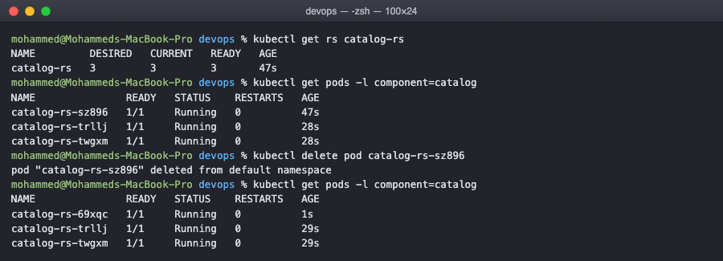
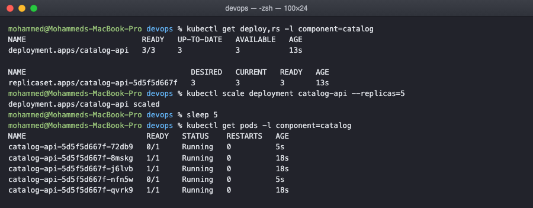
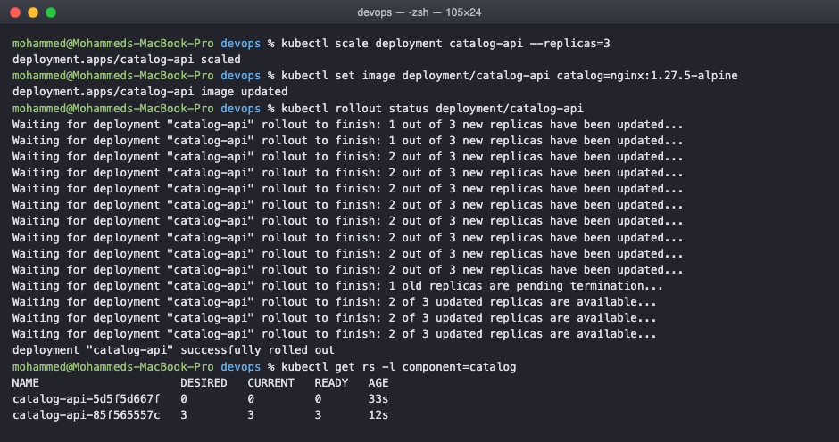
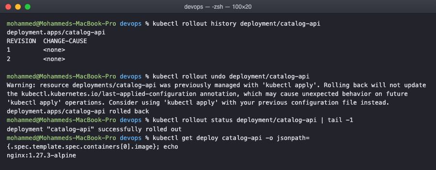
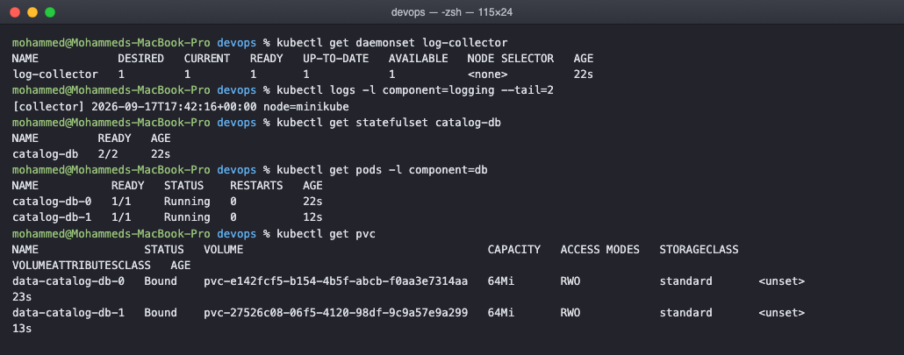
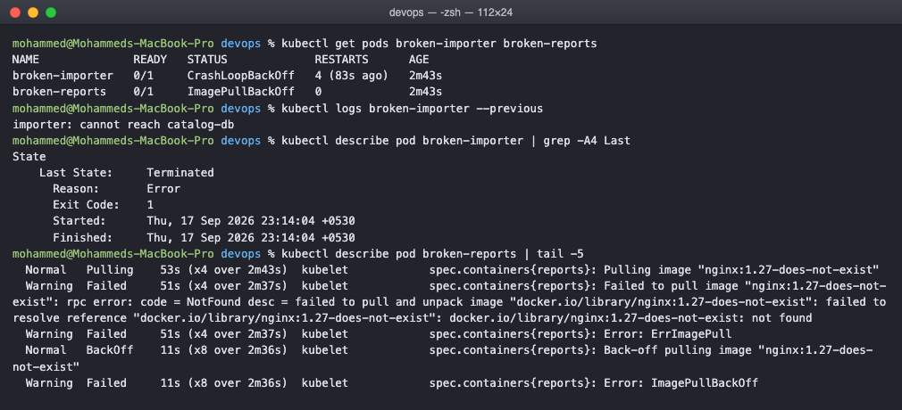

# Kubernetes Core Objects Homework

Working through the objects that actually run workloads: replicaset, deployment,
daemonset and statefulset, plus what a pod looks like when it goes wrong. All the
manifests are in the manifests folder and the broken ones are in troubleshooting.

I am naming everything after a small library app, so catalog-api is the web tier,
catalog-db is the database and log-collector is the agent that runs on every node. That
way the objects relate to each other instead of all being called nginx.

## ReplicaSet: keeping a number of pods alive

A replicaset does one job, it keeps a set number of identical pods running. The selector
is how it decides which pods are its own.

    spec:
      replicas: 3
      selector:
        matchLabels:
          app: library
          component: catalog

    $ kubectl apply -f manifests/01-catalog-replicaset.yaml
    replicaset.apps/catalog-rs created

    $ kubectl get rs catalog-rs
    NAME         DESIRED   CURRENT   READY   AGE
    catalog-rs   3         3         3       47s

The interesting part is what happens when a pod disappears. I deleted one by name:

    $ kubectl get pods -l component=catalog
    NAME               READY   STATUS    RESTARTS   AGE
    catalog-rs-sz896   1/1     Running   0          47s
    catalog-rs-trllj   1/1     Running   0          28s
    catalog-rs-twgxm   1/1     Running   0          28s

    $ kubectl delete pod catalog-rs-sz896
    pod "catalog-rs-sz896" deleted from default namespace

    $ kubectl get pods -l component=catalog
    NAME               READY   STATUS    RESTARTS   AGE
    catalog-rs-69xqc   1/1     Running   0          1s
    catalog-rs-trllj   1/1     Running   0          29s
    catalog-rs-twgxm   1/1     Running   0          29s

Still three pods. The one I deleted is gone for good and catalog-rs-69xqc is a brand new
pod, one second old. Nothing repaired the old pod, the controller just noticed the count
was 2 when it should be 3 and made another one. That is the control loop from the
previous task doing its job.

## Deployment: a replicaset you can change safely

You almost never write a replicaset by hand. A deployment creates one for you and, more
importantly, creates a second one when the pod template changes so it can move pods over
gradually.

    strategy:
      type: RollingUpdate
      rollingUpdate:
        maxUnavailable: 1     # at most one pod down at a time
        maxSurge: 1           # at most one extra pod during the roll

    $ kubectl get deploy,rs -l component=catalog
    NAME                          READY   UP-TO-DATE   AVAILABLE   AGE
    deployment.apps/catalog-api   3/3     3            3           13s

    NAME                                     DESIRED   CURRENT   READY   AGE
    replicaset.apps/catalog-api-5d5f5d667f   3         3         3       13s

The deployment made a replicaset with a hash in the name. That hash comes from the pod
template, which matters in a moment.

Scaling is a one liner and does not need the file to be edited:

    $ kubectl scale deployment catalog-api --replicas=5
    deployment.apps/catalog-api scaled

    $ kubectl get pods -l component=catalog
    NAME                           READY   STATUS    RESTARTS   AGE
    catalog-api-5d5f5d667f-72db9   0/1     Running   0          5s
    catalog-api-5d5f5d667f-8mskg   1/1     Running   0          18s
    catalog-api-5d5f5d667f-j6lvb   1/1     Running   0          18s
    catalog-api-5d5f5d667f-nfn5w   0/1     Running   0          5s
    catalog-api-5d5f5d667f-qvrk9   1/1     Running   0          18s

The two new pods say Running but 0/1 ready. They are up but the readiness probe has not
passed yet, and until it does they get no traffic. Running and Ready are two different
things, which is easy to miss.

## Rolling update

Changing the image is what triggers a rollout:

    $ kubectl set image deployment/catalog-api catalog=nginx:1.27.5-alpine
    deployment.apps/catalog-api image updated

    $ kubectl rollout status deployment/catalog-api
    Waiting for deployment "catalog-api" rollout to finish: 2 out of 3 new replicas have been updated...
    Waiting for deployment "catalog-api" rollout to finish: 1 old replicas are pending termination...
    Waiting for deployment "catalog-api" rollout to finish: 2 of 3 updated replicas are available...
    deployment "catalog-api" successfully rolled out

    $ kubectl get rs -l component=catalog
    NAME                                     DESIRED   CURRENT   READY   AGE
    catalog-api-5d5f5d667f                   0         0         0       56s
    catalog-api-85f565557c                   3         3         3       13s

This is the bit I actually wanted to see. There are now two replicasets. The old one is
scaled to 0 but still exists, and the new one has the three pods. The deployment moved
pods from one to the other a few at a time, which is why the service never had zero pods
during the update.

The old replicaset being kept is not waste, it is what makes a rollback instant:

    $ kubectl rollout history deployment/catalog-api
    REVISION  CHANGE-CAUSE
    1         <none>
    2         <none>

    $ kubectl rollout undo deployment/catalog-api
    deployment.apps/catalog-api rolled back

    $ kubectl get deploy catalog-api -o jsonpath='{.spec.template.spec.containers[0].image}'
    nginx:1.27.3-alpine

Back on the old image. The rollback did not pull anything or rebuild anything, it just
scaled the old replicaset back up and the new one down.

CHANGE-CAUSE is empty because I did not record one. Adding --record is deprecated now,
the way to fill it is an annotation, kubernetes.io/change-cause, on the deployment.

## DaemonSet: one pod per node

A daemonset has no replicas field. The count is however many nodes there are, so it is
used for per machine work: log shippers, metrics agents, the network plugin itself.

    $ kubectl get daemonset log-collector
    NAME            DESIRED   CURRENT   READY   UP-TO-DATE   AVAILABLE   NODE SELECTOR   AGE
    log-collector   1         1         1       1            1           <none>          22s

    $ kubectl logs -l component=logging --tail=2
    [collector] 2026-09-17T17:42:16+00:00 node=minikube

DESIRED is 1 only because minikube is a single node cluster. Add a node and it becomes 2
without anyone changing the manifest.

The pod learns its own node name through the downward API, which is a neat trick worth
remembering:

    env:
      - name: NODE_NAME
        valueFrom:
          fieldRef:
            fieldPath: spec.nodeName

## StatefulSet: pods with identity

A deployment's pods are interchangeable and get random names. A database cannot work like
that, because replica 0 and replica 1 are not the same thing and each needs its own disk.

    $ kubectl get statefulset catalog-db
    NAME         READY   AGE
    catalog-db   2/2     22s

    $ kubectl get pods -l component=db
    NAME           READY   STATUS    RESTARTS   AGE
    catalog-db-0   1/1     Running   0          22s
    catalog-db-1   1/1     Running   0          12s

    $ kubectl get pvc
    NAME                STATUS   VOLUME                                     CAPACITY   ACCESS MODES
    data-catalog-db-0   Bound    pvc-e142fcf5-b154-4b5f-abcb-f0aa3e7314aa   64Mi       RWO
    data-catalog-db-1   Bound    pvc-27526c08-06f5-4120-98df-9c9a57e9a299   64Mi       RWO

Three differences from a deployment are visible right there. The names are predictable,
catalog-db-0 and catalog-db-1, not random hashes. The ages are 22s and 12s, so pod 0 was
created and became ready before pod 1 was started at all, they come up in order. And the
volumeClaimTemplate gave each pod its own claim, named after the pod, which follows that
pod if it is rescheduled.

## When a pod will not run

Two broken pods on purpose, because the states are worth recognising.

    $ kubectl get pods broken-importer broken-reports
    NAME              READY   STATUS             RESTARTS      AGE
    broken-importer   0/1     CrashLoopBackOff   4 (83s ago)   2m43s
    broken-reports    0/1     ImagePullBackOff   0             2m43s

CrashLoopBackOff, from a container that exits with status 1 immediately. The name is
often misread as the error. It is not, it means the container keeps exiting and
Kubernetes is waiting longer and longer between restarts. The actual reason is in the
logs of the run that already died, which needs --previous because the current container
does not exist yet:

    $ kubectl logs broken-importer --previous
    importer: cannot reach catalog-db

    $ kubectl describe pod broken-importer | grep -A4 'Last State'
        Last State:     Terminated
          Reason:       Error
          Exit Code:    1

ImagePullBackOff is a different failure and it never even reached the container. The pod
is stuck before starting, and describe shows why at the bottom of the events:

    Warning  Failed  kubelet  Failed to pull image "nginx:1.27-does-not-exist": ...
             failed to resolve reference "docker.io/library/nginx:1.27-does-not-exist": not found
    Warning  Failed  kubelet  Error: ImagePullBackOff

So the rule I took away: for CrashLoopBackOff read the logs, because the container ran
and said something. For ImagePullBackOff read the events with describe, because there are
no logs to read. A wrong tag, a private registry with no pull secret, or a typo all land
here.

## Cleaning up

    kubectl delete -f manifests/
    kubectl delete -f troubleshooting/
    kubectl delete pvc --all      # statefulset claims are not removed with the statefulset

## What I understood

The four objects are really answers to four different questions. How many copies do I
want, and are they interchangeable? That is a deployment. How do I change them without
downtime? Also the deployment, through the replicaset it manages. Does this need to run
on every machine? That is a daemonset. Do the copies have identity and their own disks?
That is a statefulset.

The deployment and replicaset relationship finally made sense when I saw two replicasets
side by side. The deployment does not manage pods at all, it manages replicasets, and the
replicasets manage pods. A rolling update is just the deployment moving the desired count
from one replicaset to another, one step at a time.

Deleting a statefulset leaves the persistent volume claims behind on purpose. That is the
right default for a database, since deleting the workload should not throw away the data,
but it does mean the claims need cleaning up by hand afterwards.
